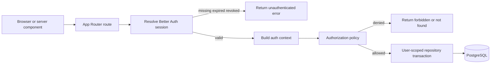
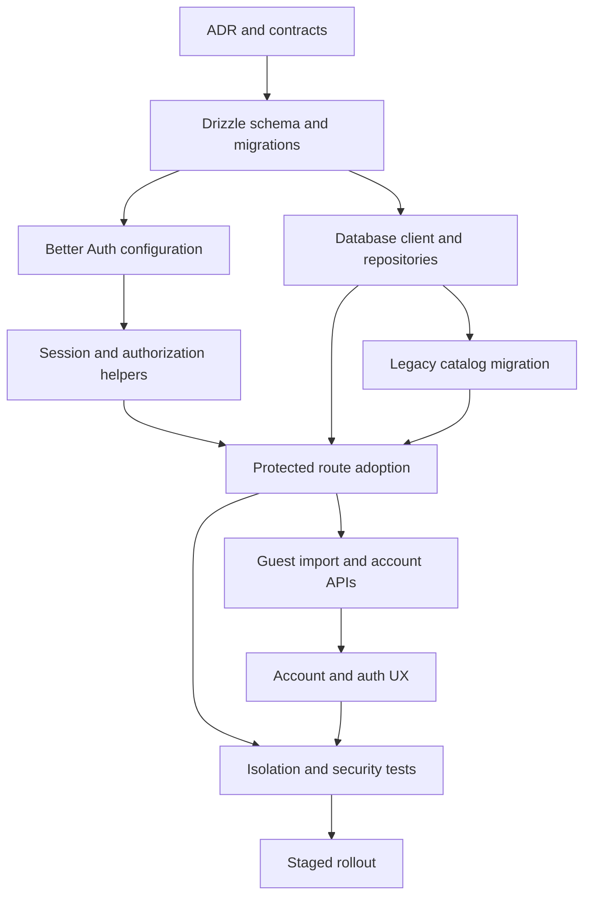

# TikPlay Multi-user Auth and Data Foundation Plan

- **Status:** Approved planning baseline for implementation
- **Workstream:** A — Architecture and auth foundation
- **Scope:** Architecture and migration contract only; no source implementation
- **Inputs:** [`PRD.md`](../PRD.md), [`AGENTS.md`](../AGENTS.md), [`package.json`](../package.json), [`lib/db/index.ts`](../lib/db/index.ts), [`lib/db/queries.ts`](../lib/db/queries.ts), and all existing routes under [`app/api`](../app/api)
- **Decisions confirmed:** Better Auth, Drizzle ORM, managed PostgreSQL through `DATABASE_URL`, Resend for magic links, legacy tracks become a global catalog, selected legacy playlists become editorial, legacy favorites/history are not assigned to users, account deletion uses a 30-day soft-delete window, listening events are retained for 180 days.

## 1. ADR: choose Better Auth over Auth.js

### 1.1 Decision

Adopt **Better Auth** with its Next.js handler, Drizzle PostgreSQL adapter, database-backed sessions, Google social provider, and magic-link plugin. Use Better Auth's generated schema as the compatibility baseline for auth-owned tables, then add TikPlay fields and application tables through reviewed Drizzle migrations.

Keep email/password authentication disabled. Apple and passkeys are follow-up providers/plugins, not hidden MVP features. Account linking is disabled for unauthenticated same-email sign-ins; a future linking UX must start from an authenticated session and require conflict-safe verification.

### 1.2 Decision drivers

| Driver                           | Better Auth                                                                                              | Auth.js                                                                                                                                | Assessment                                                                                             |
| -------------------------------- | -------------------------------------------------------------------------------------------------------- | -------------------------------------------------------------------------------------------------------------------------------------- | ------------------------------------------------------------------------------------------------------ |
| Next.js 16 App Router            | Provides `toNextJsHandler` for catch-all route handlers and server APIs that consume request headers     | Strong App Router integration through exported handlers and `auth`                                                                     | Both viable; verify the pinned version against Next.js 16 in a foundation spike                        |
| PostgreSQL                       | First-party Drizzle adapter with PostgreSQL transaction support and schema generation                    | Mature PostgreSQL, Prisma, and Drizzle adapter choices                                                                                 | Both viable                                                                                            |
| Google                           | Built-in social provider                                                                                 | Built-in provider                                                                                                                      | Equal for MVP                                                                                          |
| Magic link                       | Dedicated plugin with application-controlled email delivery                                              | Established email provider model                                                                                                       | Both viable; Better Auth keeps delivery under an explicit `sendMagicLink` boundary suitable for Resend |
| Database sessions and revocation | Session listing/revocation are first-class; device metadata can extend the session model                 | Database sessions are mature, but product-level device/session management requires more custom APIs                                    | Better Auth advantage                                                                                  |
| Apple follow-up                  | Built-in social provider                                                                                 | Built-in provider                                                                                                                      | Equal                                                                                                  |
| Passkey follow-up                | Official passkey plugin and authenticator schema path                                                    | WebAuthn/passkey support exists, including an authenticator model                                                                      | Better Auth has the more cohesive plugin path for this roadmap                                         |
| Secure account linking           | Configurable linking and unlinking APIs; token encryption option; still requires explicit TikPlay policy | Safe default rejects arbitrary same-email linking; authenticated linking/unlinking UX remains less complete in current documented flow | Better Auth advantage for the stated roadmap                                                           |
| Operational complexity           | More plugins and generated auth schema, but one cohesive stack with Drizzle                              | Mature ecosystem, but extended identity capabilities would need more application-owned orchestration                                   | Better Auth better matches the future feature set                                                      |
| Lock-in and maturity             | Newer API surface; upgrades and generated schema changes require discipline                              | Older, widely deployed ecosystem                                                                                                       | Auth.js advantage; mitigated by pinning and isolating auth behind TikPlay helpers                      |

### 1.3 Why Auth.js is not selected

Auth.js is a credible fallback and would satisfy Google, magic link, PostgreSQL, and database sessions. It is not selected because TikPlay explicitly plans user-visible session revocation, Apple, passkeys, and safe account linking. Better Auth provides these as a more integrated progression, reducing the amount of custom identity protocol code TikPlay would own.

This decision is not permission to enable automatic linking. The PRD rule remains authoritative: matching email text alone never links OAuth identities. Do not enable broad trusted-provider or dangerous email-linking options as a convenience shortcut.

### 1.4 Consequences and guardrails

- Pin exact Better Auth and plugin versions in [`package.json`](../package.json); do not use a floating prerelease.
- Run a compatibility spike before schema freeze: callback round-trip, magic-link single use, server session lookup, session revocation, and production build on the pinned Next.js version.
- Keep Better Auth calls inside [`lib/auth`](../lib/auth) and the catch-all auth route; application routes consume TikPlay session/authorization helpers rather than plugin internals.
- Set OAuth token encryption on if provider tokens are persisted. Do not expose tokens through session payloads.
- Store OAuth state in the database and retain provider-default state, nonce, PKCE, and redirect validation.
- Generate and diff auth schema on every Better Auth upgrade. No runtime auto-migration in production.
- Revisit the ADR only if the compatibility spike fails, a required Better Auth feature is unstable on the pinned stack, or its schema/API cannot support transactional session revocation.

## 2. PostgreSQL and Drizzle data model

### 2.1 Conventions

- PostgreSQL is authoritative for all authenticated ownership and activity records.
- Use UUIDv7 application-generated identifiers where supported by the selected ID package; otherwise use PostgreSQL UUID defaults consistently. Do not mix integer and string IDs in new APIs.
- Use `timestamptz` in UTC and `created_at`/`updated_at` defaults of `now()`.
- Use `citext` for canonical email uniqueness, or an equivalent unique index on `lower(email)`. Preserve the original display email only if needed.
- Use explicit enums or check constraints for finite security-sensitive states.
- Use foreign keys in PostgreSQL even when the ORM also models relations.
- Shared track/media metadata is global. Favorites, library membership, playlists, rules, preferences, and history are user-scoped.
- A synthetic `All Tracks` playlist is not stored. The authenticated library is represented by `user_library_tracks`.

### 2.2 Auth-owned tables

Better Auth's pinned generated schema is the source for exact required field names. The following invariants are mandatory even if generated names differ.

#### `users`

| Column                    | Type         | Rules                                                                        |
| ------------------------- | ------------ | ---------------------------------------------------------------------------- |
| `id`                      | uuid         | primary key                                                                  |
| `email`                   | citext       | not null, unique while active; normalized before insert                      |
| `email_verified`          | boolean      | not null, default false; retained for Better Auth compatibility              |
| `email_verified_at`       | timestamptz  | nullable; set on verified magic link or verified provider assertion          |
| `name`                    | varchar(120) | nullable; Better Auth-compatible display name                                |
| `image`                   | text         | nullable; validated `https` URL or trusted app path, maximum 2048 characters |
| `locale`                  | varchar(35)  | not null, default `vi-VN`                                                    |
| `role`                    | varchar(20)  | not null, default `user`, check in `user`, `admin`                           |
| `onboarding_completed_at` | timestamptz  | nullable                                                                     |
| `created_at`              | timestamptz  | not null, default now                                                        |
| `updated_at`              | timestamptz  | not null, default now                                                        |
| `deletion_requested_at`   | timestamptz  | nullable                                                                     |
| `purge_after`             | timestamptz  | nullable; must be at least deletion request time                             |
| `deleted_at`              | timestamptz  | nullable; marks login-disabled soft deletion                                 |

Constraints/indexes:

- Unique `users_email_key` on normalized email. During the 30-day deletion window the identity remains reserved; do not permit a new account with the same email.
- Check that deletion timestamps are coherent: `purge_after IS NULL OR deletion_requested_at IS NOT NULL`, and `deleted_at IS NULL OR deletion_requested_at IS NOT NULL`.
- Index `users_purge_after_idx` on `purge_after` where non-null for the purge worker.
- Index `users_role_idx` only if admin queries justify it; role checks normally use primary-key session lookup.

#### `accounts`

| Column                     | Type         | Rules                                            |
| -------------------------- | ------------ | ------------------------------------------------ |
| `id`                       | uuid         | primary key                                      |
| `user_id`                  | uuid         | not null, foreign key to users, cascade on purge |
| `provider_id`              | varchar(64)  | not null; for example `google`, later `apple`    |
| `account_id`               | varchar(255) | not null; provider subject/account identifier    |
| `access_token`             | text         | nullable, encrypted at application layer         |
| `refresh_token`            | text         | nullable, encrypted at application layer         |
| `id_token`                 | text         | nullable, encrypted or omitted when not needed   |
| `access_token_expires_at`  | timestamptz  | nullable                                         |
| `refresh_token_expires_at` | timestamptz  | nullable                                         |
| `scope`                    | text         | nullable                                         |
| `password`                 | text         | nullable but always null for TikPlay MVP         |
| `created_at`               | timestamptz  | not null                                         |
| `updated_at`               | timestamptz  | not null                                         |

Constraints/indexes:

- Unique `(provider_id, account_id)` prevents one external identity from belonging to multiple users.
- Index `(user_id, provider_id)` for account management.
- Optional unique `(user_id, provider_id)` only if product policy limits a user to one account per provider; do not add it until Apple relay-email and multiple-provider-account behavior are verified.
- Never create an account association from a client-provided `user_id`.

#### `sessions`

| Column           | Type         | Rules                                                             |
| ---------------- | ------------ | ----------------------------------------------------------------- |
| `id`             | uuid         | primary key                                                       |
| `user_id`        | uuid         | not null, foreign key to users, cascade on purge                  |
| `token`          | varchar(255) | not null, unique; store Better Auth's required representation     |
| `expires_at`     | timestamptz  | not null                                                          |
| `created_at`     | timestamptz  | not null                                                          |
| `updated_at`     | timestamptz  | not null                                                          |
| `last_seen_at`   | timestamptz  | not null, default now; throttle writes                            |
| `ip_address`     | inet         | nullable; minimize retention and avoid exposing to users verbatim |
| `user_agent`     | text         | nullable, maximum bounded before storage                          |
| `device_label`   | varchar(120) | nullable, derived display label only                              |
| `revoked_at`     | timestamptz  | nullable                                                          |
| `revoked_reason` | varchar(40)  | nullable, finite application values                               |

Constraints/indexes:

- Unique `sessions_token_key`.
- Index `(user_id, expires_at DESC)` for devices/session listing.
- Partial index `(user_id, last_seen_at DESC) WHERE revoked_at IS NULL`.
- Check `revoked_at IS NULL OR revoked_at >= created_at`.
- Session validation rejects expired, revoked, soft-deleted-user, and purged-user sessions.
- Revocation is a transactional database update followed by cookie invalidation for the current session where applicable.

#### `verifications`

| Column        | Type        | Rules                                                                     |
| ------------- | ----------- | ------------------------------------------------------------------------- |
| `id`          | uuid        | primary key                                                               |
| `identifier`  | citext      | not null; normalized email or Better Auth identifier                      |
| `value`       | text        | not null; hash/token representation required by Better Auth, never logged |
| `expires_at`  | timestamptz | not null                                                                  |
| `created_at`  | timestamptz | not null                                                                  |
| `updated_at`  | timestamptz | not null                                                                  |
| `consumed_at` | timestamptz | nullable if supported without violating adapter expectations              |

Constraints/indexes:

- Unique on the library-required token identity; single-use consumption must be atomic.
- Index `verifications_expires_at_idx` for cleanup.
- Index `(identifier, expires_at DESC)` for rate-limit/support diagnostics, without exposing whether an account exists.
- Delete expired/consumed rows on a scheduled basis.

#### Future `passkeys`

Reserve no hand-written MVP table. When passkeys start, generate the exact plugin schema and add: unique credential ID, user foreign key with cascade, public key, counter, device type, backup state, transports, creation and last-used timestamps. Never store private key material.

### 2.3 Application tables

#### `user_preferences`

- `user_id uuid primary key` references users on delete cascade.
- `theme varchar(16) not null default 'system'` with check in `system`, `light`, `dark`.
- `locale varchar(35) not null default 'vi-VN'`.
- `personalization_enabled boolean not null default true`.
- `explicit_content_allowed boolean not null default true`.
- `selected_moods text[] not null default '{}'` and `use_cases text[] not null default '{}'`; validate values in service code or normalized lookup tables if categories become admin-managed.
- `created_at`, `updated_at timestamptz not null`.

Keep profile locale canonical in one place during implementation. Preferred rule: `users.locale` supports auth/profile display and mirrors `user_preferences.locale` transactionally until the former can be removed; document the temporary duplication in the migration.

#### `tracks`

- `id uuid primary key`.
- `legacy_id bigint nullable unique` for migration traceability; remove only after rollback horizon.
- `source varchar(20) not null` with check against supported media sources.
- `source_url text not null`, bounded to 2048 in application validation.
- `canonical_source_url text not null`.
- `audio_key char(64) not null unique` with lowercase hexadecimal check.
- `title varchar(200) not null`, `author varchar(120) not null`.
- `cover_url text not null default ''`.
- `duration_seconds double precision not null` with check `>= 0`.
- `category varchar(64) not null default 'others'`.
- `default_start_seconds double precision nullable`, `default_end_seconds double precision nullable`; both non-negative and end greater than start when both exist.
- `created_at`, `updated_at timestamptz not null`.
- Unique normalized canonical URL where canonicalization is stable. If multiple source URLs can legitimately map to one audio key, `audio_key` is the final dedupe key and URL conflict handling updates aliases rather than duplicating tracks.
- Index `(category, created_at DESC)`, `(source, created_at DESC)`, and trigram/full-text indexes for title/author only after query measurement.

Global mutable metadata is admin/editorial-owned. Ordinary users must not mutate/delete `tracks`; per-user trimming or naming belongs in `user_library_tracks` if retained as a product feature.

#### `user_library_tracks`

- `user_id uuid not null` references users on delete cascade.
- `track_id uuid not null` references tracks on delete restrict.
- `added_at timestamptz not null default now()`.
- `source_kind varchar(20) not null default 'direct'` with check in `direct`, `guest_import`, `playlist_import`, `system`.
- `guest_import_id uuid nullable` references guest imports on delete set null.
- Optional per-user fields: `custom_title varchar(200)`, `custom_author varchar(120)`, `start_seconds`, `end_seconds`, with the same range checks as tracks.
- Primary key `(user_id, track_id)`.
- Index `(user_id, added_at DESC)`.
- Index `(track_id)` for catalog deletion/reference diagnostics.

#### `favorites`

- `user_id uuid not null` references users on delete cascade.
- `track_id uuid not null` references tracks on delete restrict.
- `created_at timestamptz not null default now()`.
- Primary key `(user_id, track_id)`.
- Index `(user_id, created_at DESC)` and `(track_id)`.
- Favorite creation must also ensure or create library membership in one transaction.

#### `playlists`

- `id uuid primary key`.
- `owner_user_id uuid nullable` references users on delete cascade.
- `kind varchar(16) not null default 'user'` with check in `user`, `editorial`.
- `name varchar(80) not null`.
- `visibility varchar(16) not null default 'private'` with check in `private`, `unlisted`, `public`.
- `share_id varchar(32) nullable unique`; null for MVP private playlists unless editorial/public access needs it.
- `sort_order integer not null default 0` with check `>= 0`.
- `legacy_id bigint nullable unique`.
- `created_at`, `updated_at timestamptz not null`.
- Check `(kind = 'user' AND owner_user_id IS NOT NULL) OR (kind = 'editorial' AND owner_user_id IS NULL)`.
- Check editorial playlists are not private; selected migration rows default to `public`.
- Index `(owner_user_id, sort_order, id)` for a user's library.
- Index `(visibility, updated_at DESC)` where visibility is not private.
- User playlist names are not globally unique. Guest-import conflict detection compares normalized names within an owner but resolves by deterministic suffix rather than relying on a hard uniqueness constraint.

#### `playlist_tracks`

- `playlist_id uuid not null` references playlists on delete cascade.
- `track_id uuid not null` references tracks on delete restrict.
- `position integer not null` with check `>= 0`.
- `added_at timestamptz not null default now()`.
- `added_by_user_id uuid nullable` references users on delete set null.
- Primary key `(playlist_id, track_id)` prevents duplicate membership.
- Deferrable unique `(playlist_id, position)` permits atomic reorder transactions without transient collisions.
- Index `(playlist_id, position)` and `(track_id)`.

#### `auto_rules`

- `id uuid primary key`.
- `playlist_id uuid not null` references playlists on delete cascade.
- `owner_user_id uuid not null` references users on delete cascade; denormalized for efficient authorization and guarded in service code/transaction to equal the playlist owner.
- `keyword varchar(120) not null`.
- `match_mode varchar(20) not null` with check in `contains`, `starts_with`.
- `created_at`, `updated_at timestamptz not null`.
- Unique `(playlist_id, lower(keyword), match_mode)` via expression index.
- Index `(owner_user_id, created_at DESC)`.

#### `listening_events`

- `id uuid primary key`.
- `user_id uuid not null` references users on delete cascade.
- `track_id uuid not null` references tracks on delete restrict.
- `event_id uuid not null`; client-generated idempotency key unique per user.
- `played_at timestamptz not null` with bounded future-skew validation.
- `duration_listened_seconds double precision not null` with check `>= 0`.
- `completion_ratio double precision not null` with check between 0 and 1.
- `classification varchar(16) not null` with check in `started`, `skipped`, `partial`, `completed`.
- `created_at timestamptz not null default now()`.
- Unique `(user_id, event_id)`.
- Index `(user_id, played_at DESC)`, `(user_id, track_id, played_at DESC)`, and `(track_id, played_at DESC)` only if aggregate popularity needs it.
- Scheduled deletion where `played_at < now() - interval '180 days'`.
- Guests do not create server history. Their local history can be omitted from import under the selected legacy policy.

Do not retain `play_count` and `last_played_at` globally on tracks as personalized truth. Derive per-user summaries from events or maintain a transactional `user_track_stats` projection keyed by `(user_id, track_id)` if measurement shows it is necessary.

#### `guest_imports`

- `id uuid primary key`.
- `user_id uuid not null` references users on delete cascade.
- `idempotency_key uuid not null` supplied by the client snapshot.
- `payload_hash char(64) not null` prevents key reuse with different content.
- `status varchar(20) not null` with check in `pending`, `processing`, `completed`, `failed`.
- `requested_counts jsonb not null`, `result_counts jsonb nullable`, `conflicts jsonb nullable` with application schemas and size limits.
- `error_code varchar(64) nullable`; no raw stack or token.
- `created_at`, `started_at`, `completed_at`, `updated_at timestamptz`.
- Unique `(user_id, idempotency_key)`.
- Index `(user_id, created_at DESC)` and partial stale-processing index on `updated_at` where status is processing.
- Execute import rows, memberships, favorites, and playlists transactionally; completed retries return the stored result.

#### `auth_audit_events`

- `id uuid primary key`, `user_id uuid nullable` with delete set null.
- `actor_user_id uuid nullable`, `session_id uuid nullable` with delete set null.
- `event_type varchar(64) not null`, `outcome varchar(16) not null`, `reason_code varchar(64) nullable`.
- `provider_id varchar(64) nullable`, `target_account_id uuid nullable`.
- Minimized `ip_hash`, user-agent summary, and structured metadata without raw email or tokens.
- `created_at timestamptz not null`.
- Index `(user_id, created_at DESC)` and `(event_type, created_at DESC)`.
- Retention baseline: 365 days for security events; review with privacy policy before launch.

Record link, unlink, session revoke, deletion request/cancel/purge, magic-link request outcome, and auth conflict events. Do not use this as general application logging.

#### Compliance and operational tables

Move current globally shared records to PostgreSQL without user ownership:

- `copyright_reports` and `blocked_media` retain global legal semantics and foreign-key references to tracks where possible.
- Operational YouTube cookies must **not** move from JSON into a general settings table. Store them in the deployment secret manager or an encrypted dedicated secret store. The API must never return cookie contents.
- Add `schema_migrations` through Drizzle's migrator and `data_migrations` with unique migration name, source hash, status, counts, started/completed timestamps, and error summary.

### 2.4 Deletion behavior

On account deletion request, in one transaction:

1. Set `deletion_requested_at`, `deleted_at`, and `purge_after = now() + interval '30 days'`.
2. Revoke every active session and prevent all new sign-ins/account links for that user.
3. Cancel pending magic links for the email where adapter-safe.
4. Keep personal records inaccessible during the recovery window.
5. Permit cancellation only through a documented, strongly verified recovery flow; ordinary login remains blocked unless that flow is implemented.

At purge time, delete the user. Cascades remove accounts, sessions, preferences, library membership, favorites, user playlists, rules, history, guest imports, and user-owned audit references. Shared tracks/media remain. The purge job is idempotent and records aggregate completion without retaining deleted identity data.

## 3. Migration from JSON and legacy policy

### 3.1 Selected policy

- Import every valid legacy track as a global catalog row and preserve `audio_key` so files under the current cache remain addressable.
- Treat legacy playlist ID `1` and name `All Tracks` as synthetic; do not migrate it as a playlist.
- Import only a deployment-approved allowlist of legacy playlists as ownerless editorial/public playlists. Do not infer editorial status from name alone.
- Do not assign legacy favorites, listening history, global play counts, or last-played timestamps to any account.
- Do not create a designated owner account automatically.
- Legacy auto-rules are not migrated because they imply personal ownership. They may be exported for manual reconstruction after an owner is selected.
- Import copyright reports and blocked-media records as global compliance data.
- Export legacy YouTube cookie settings to deployment secrets through a separate operator-controlled process; never copy plaintext/base64 cookie material into normal PostgreSQL settings.

### 3.2 Migration phases

#### Phase M0 — inventory and freeze contract

- Validate JSON against the current shape in [`lib/db/index.ts`](../lib/db/index.ts).
- Produce counts and orphan reports for tracks, playlists, playlist tracks, favorites, rules, reports, blocked media, history, and settings.
- Obtain the explicit editorial playlist allowlist and record it in migration configuration.
- Hash the source JSON and record cache directory inventory by audio key.
- Take a timestamped, access-restricted backup of JSON and relevant cache metadata.

#### Phase M1 — schema-only deploy

- Apply additive PostgreSQL migrations with no route cutover.
- Deploy database connectivity/health checks, auth schema, and migration tooling.
- Keep JSON as the live source while verifying database migrations and connection pooling.

#### Phase M2 — dry run

- Parse JSON without mutation.
- Canonicalize source URLs using the same media normalization implementation intended for production.
- Calculate deterministic UUID mapping from migration name plus legacy entity type/ID, or persist an explicit mapping table.
- Report duplicate URLs/audio keys, orphan playlist rows, malformed ranges, missing cache files, and legal-block relationships.
- Abort on ambiguous audio-key collisions or broken compliance relationships; allow documented skips only for nonessential malformed personal rows.

#### Phase M3 — idempotent import

Run a single controlled job identified by source hash and migration version:

1. Insert/upsert tracks by `audio_key`, populate `legacy_id`, and preserve metadata.
2. Insert compliance rows and blocked-media relationships.
3. Insert only allowlisted editorial playlists.
4. Insert editorial playlist tracks using mapped track IDs and normalized, gap-free positions.
5. Record skipped legacy favorites/history/rules counts as policy decisions, not errors.
6. Commit each bounded domain transaction and mark the overall migration complete only after validation passes.

A rerun with the same migration name/source hash must return the stored completed result. A different source hash under the same name must fail.

#### Phase M4 — shadow validation

- Compare track count after deduplication, audio-key set, selected playlist count/membership/order, compliance counts, and blocked keys.
- Sample API-equivalent reads from PostgreSQL and verify cache files remain resolvable.
- Verify no `users`, `favorites`, `user_library_tracks`, or `listening_events` were manufactured from legacy global personal data.
- Retain JSON read-only and continue serving production from JSON until the cutover gate is approved.

#### Phase M5 — route cutover

- Cut global catalog/compliance reads to PostgreSQL first.
- Enable Better Auth and user-scoped repositories behind a deployment flag.
- Migrate routes in the dependency order in Section 7.
- Do not dual-write user data to JSON. After a protected route is cut over, PostgreSQL is its sole source of truth.
- Keep a short rollback window in which legacy global routes can read the frozen JSON, but never merge new PostgreSQL personal data back into shared JSON.

#### Phase M6 — retire JSON

- Remove live writes through [`lib/db/index.ts`](../lib/db/index.ts) only after all route gates pass.
- Archive the source JSON encrypted with restricted access and a deletion date.
- Remove `DB_PATH` from the application runtime after rollback expiry; retain only for an offline migration/inspection command if needed.

### 3.3 Guest browser import versus deployment legacy migration

These are separate workflows:

- Deployment migration handles the current shared server JSON under the policy above.
- Guest import handles a browser-local snapshot after a user signs in. It uses `guest_imports`, an idempotency key, payload hash, explicit preview/selection, deterministic track dedupe, playlist rename suffixes such as `Imported from guest`, and a local recovery snapshot retained until confirmed.

Never reinterpret shared server JSON favorites/history as a guest snapshot.

## 4. Server session and authorization architecture

### 4.1 Request flow

### 4.2 Proposed boundaries

- [`lib/auth/index.ts`](../lib/auth/index.ts): server-only Better Auth configuration, providers, plugins, cookies, callbacks, and database adapter.
- [`lib/auth/client.ts`](../lib/auth/client.ts): client-safe Better Auth client only; no secrets or authorization logic.
- [`app/api/auth/[...all]/route.ts`](../app/api/auth/[...all]/route.ts): thin Better Auth Next.js handler.
- [`lib/auth/session.ts`](../lib/auth/session.ts): `getOptionalSession`, `requireSession`, active-user checks, and minimized typed auth context.
- [`lib/auth/authorization.ts`](../lib/auth/authorization.ts): `requireRole`, `requirePlaylistOwner`, private-resource visibility policy, current-session checks, and consistent denial semantics.
- [`lib/api/errors.ts`](../lib/api/errors.ts): stable codes and response mapping: `UNAUTHENTICATED` 401, `FORBIDDEN` 403, `NOT_FOUND` 404, `CONFLICT` 409, `VALIDATION_ERROR` 400/422, `RATE_LIMITED` 429, `TRANSIENT_ERROR` 503.
- [`lib/db/client.ts`](../lib/db/client.ts), [`lib/db/schema`](../lib/db/schema), and [`lib/db/repositories`](../lib/db/repositories): PostgreSQL-only access with ownership as required function input.

The exact files may be adjusted during implementation, but their ownership and dependency direction must remain: route → session/policy → repository → database. Repositories never infer a user from payloads.

### 4.3 Session rules

- Use opaque, database-backed sessions in HttpOnly cookies.
- Production cookies: `Secure`, `HttpOnly`, `Path=/`, no broad `Domain`; use the library-recommended `SameSite=Lax` unless callback testing demonstrates a stricter compatible setting.
- Derive trusted origin/base URL from explicit environment configuration. Allowlist callback and post-auth redirect paths; reject arbitrary absolute redirect URLs.
- Server components and route handlers resolve the session from request headers/cookies. Do not treat client session state as authorization evidence.
- Return only `user.id`, display fields, role, current `session.id`, and expiry to the application. Never return OAuth tokens or session token.
- Throttle `last_seen_at` updates to avoid a write on every media/API request.
- Cache behavior must not leak sessions: protected/private responses use `Cache-Control: private, no-store` and vary by cookie where relevant. Public media may remain immutable.
- Middleware may improve redirects but is not an authorization boundary; each route/service enforces authorization again.
- Session expiry/sign-out clears user-scoped client caches but does not destroy the global playback engine or shared media cache.

### 4.4 Authorization rules

- **Guest-allowed:** public catalog discovery, media streaming, source processing under rate limits, and copyright report submission.
- **Authenticated:** personal library, favorites, user playlists/rules, history, preferences, guest import, profile, session management, data export, and deletion.
- **Owner-only:** user playlist read/mutation unless a future visibility policy explicitly allows public/unlisted reads. Return 404 rather than 403 when revealing existence would leak a private resource.
- **Admin-only:** copyright moderation, YouTube cookie configuration, cache/track health mutations, and global catalog metadata/destructive mutations.
- **Server-selected identity:** route handlers pass `session.user.id`; bodies and query strings never select authoritative owner IDs.
- **Transactional check-and-write:** ownership validation and mutation execute in one transaction or one ownership-constrained SQL statement to avoid time-of-check/time-of-use races.
- **Role freshness:** role is read from the current database session/user relationship, not accepted from a long-lived client claim.

Replace the static token in [`lib/adminAuth.ts`](../lib/adminAuth.ts) with role-based sessions after a bootstrap process grants the first admin. During transition, either require both a valid admin session and `ADMIN_TOKEN` for dangerous routes or isolate token auth behind an explicit short-lived feature flag. The unprotected YouTube cookie route is a release blocker.

## 5. Environment, secrets, and email requirements

### 5.1 Required environment variables

| Variable                           | Sensitivity        | Requirement                                                                                                  |
| ---------------------------------- | ------------------ | ------------------------------------------------------------------------------------------------------------ |
| `DATABASE_URL`                     | secret             | Managed PostgreSQL connection string with TLS; use pooled runtime URL if provider supplies one               |
| `DATABASE_MIGRATION_URL`           | secret             | Optional direct/non-pooled URL for migrations; required when the pooler does not support migration locks/DDL |
| `BETTER_AUTH_SECRET`               | secret             | At least 32 random bytes; distinct per environment; rotation needs a documented session-impact procedure     |
| `BETTER_AUTH_URL`                  | configuration      | Canonical origin, HTTPS in production, no path suffix                                                        |
| `GOOGLE_CLIENT_ID`                 | secret-like config | Separate OAuth app per environment                                                                           |
| `GOOGLE_CLIENT_SECRET`             | secret             | Server only                                                                                                  |
| `RESEND_API_KEY`                   | secret             | Restricted sending key per environment                                                                       |
| `AUTH_EMAIL_FROM`                  | configuration      | Verified sender, for example `TikPlay <login@auth.example.com>`                                              |
| `AUTH_ALLOWED_ORIGINS`             | configuration      | Exact comma-separated trusted origins if Better Auth requires cross-origin trust                             |
| `OAUTH_TOKEN_ENCRYPTION_KEY`       | secret             | Versioned key if separate from Better Auth secret; required before persisting provider tokens                |
| `ADMIN_BOOTSTRAP_EMAILS`           | sensitive config   | Temporary explicit allowlist for initial role grant; remove/disable after bootstrap                          |
| `ACCOUNT_PURGE_DAYS`               | configuration      | Set to `30`; startup validates the policy value                                                              |
| `LISTENING_HISTORY_RETENTION_DAYS` | configuration      | Set to `180`                                                                                                 |
| `AUTH_AUDIT_RETENTION_DAYS`        | configuration      | Baseline `365`, subject to privacy approval                                                                  |

Existing media variables remain. Deprecate `DB_PATH` only after JSON retirement. `ADMIN_TOKEN` is transitional and must have a removal gate.

### 5.2 Secret handling

- Store production secrets in the hosting platform secret manager, never committed files, browser-exposed variables, Fly configuration plaintext, logs, or database migration files.
- Use separate development, preview, staging, and production credentials/databases.
- Restrict database roles: runtime role can perform application DML but not schema migration; migration role can perform reviewed DDL.
- Require TLS certificate verification supported by the managed provider; do not solve TLS errors by disabling verification globally.
- Redact connection strings, OAuth codes/tokens, session tokens, verification values, raw email addresses, and email provider payloads from logs.
- Document rotation for Better Auth secret, Google secret, Resend key, token encryption key, and database credentials. OAuth-token key rotation needs key versioning or a forced reauthorization plan.

### 5.3 Resend requirements

- Verify a dedicated sending domain and configure SPF, DKIM, and DMARC before production acceptance.
- Use a transactional sender; configure bounce/complaint webhooks with signed webhook verification.
- `sendMagicLink` receives the URL from Better Auth and sends it server-side. Do not reconstruct tokens in the client.
- Link lifetime baseline: 15 minutes, single use. A replacement request does not disclose account existence and should invalidate or safely supersede older links according to Better Auth semantics.
- Rate limit by normalized email hash and IP: conservative burst limit, resend cooldown, and broader hourly limit. Always return a generic success response.
- Permit only HTTPS production callback URLs under the canonical origin; remove tokens from visible UI state after consumption.
- Email includes purpose, expiry, ignore-if-not-requested text, support contact, and no personal listening data.
- Staging uses a verified non-production domain/audience guard. Tests inject a mail transport or capture provider boundary; they do not send real email.
- Monitor accepted, delivered, bounced, complained, delayed, and magic-link completion metrics without logging raw token URLs.

## 6. Route-by-route migration inventory

The following inventory covers every current route under [`app/api`](../app/api). `Optional session` means the route can serve guests but enriches or writes ownership when authenticated.

| Current route                                                                             | Current risk/state                                                                     | Target access and data                                                                                            | Migration action                                                                                                                                                           | Owner                                        |
| ----------------------------------------------------------------------------------------- | -------------------------------------------------------------------------------------- | ----------------------------------------------------------------------------------------------------------------- | -------------------------------------------------------------------------------------------------------------------------------------------------------------------------- | -------------------------------------------- |
| [`app/api/admin/copyright-reports/route.ts`](../app/api/admin/copyright-reports/route.ts) | Static admin token; global JSON compliance data                                        | Admin role; PostgreSQL compliance data                                                                            | Add `requireRole('admin')`; transition token as documented; transactional moderation and blocklist update; audit action                                                    | A policy, B repository/route                 |
| [`app/api/admin/youtube-cookies/route.ts`](../app/api/admin/youtube-cookies/route.ts)     | **GET and POST currently unprotected**; cookie contents stored in JSON                 | Admin role; secret manager/encrypted operational store                                                            | Protect both methods before rollout; never return secret; CSRF-safe write; audit update                                                                                    | A policy, B operational adapter/route        |
| [`app/api/audio/[key]/route.ts`](../app/api/audio/[key]/route.ts)                         | Public cached audio; blocklist in JSON                                                 | Public; filesystem media plus PostgreSQL blocklist                                                                | Keep guest access/range semantics/cache headers; migrate only blocked lookup; no session touch/last-seen write                                                             | B                                            |
| [`app/api/auto-rules/route.ts`](../app/api/auto-rules/route.ts)                           | Global personal rules, no ownership                                                    | Auth required; owner-scoped rules                                                                                 | Resolve user; validate target playlist ownership in transaction; list/delete by owner; stable errors                                                                       | A policy, B route/repository                 |
| [`app/api/categories/route.ts`](../app/api/categories/route.ts)                           | Public global tracks but global favorite flags leak shared state                       | Public catalog plus optional per-user favorite/library enrichment                                                 | PostgreSQL catalog; optional session for flags; private/no-store when personalized, public cache when anonymous                                                            | B                                            |
| [`app/api/copyright-reports/route.ts`](../app/api/copyright-reports/route.ts)             | Public report submission in JSON                                                       | Public PostgreSQL compliance write                                                                                | Preserve anti-spam/rate limit; optional user attribution only if privacy-approved; no login requirement                                                                    | B                                            |
| [`app/api/cover/[key]/route.ts`](../app/api/cover/[key]/route.ts)                         | Public cached cover; blocklist in JSON                                                 | Public; filesystem plus PostgreSQL blocklist                                                                      | Preserve immutable response; migrate block lookup; no session validation on hot media path                                                                                 | B                                            |
| [`app/api/favorites/route.ts`](../app/api/favorites/route.ts)                             | One global favorite set                                                                | Auth required; `favorites` scoped by session user                                                                 | GET/POST require session; idempotent explicit set/unset is preferred over ambiguous toggle for retry safety; ensure library membership                                     | A policy, B route/repository                 |
| [`app/api/playlists/route.ts`](../app/api/playlists/route.ts)                             | Global playlists; numeric ID `1` special case                                          | Auth required for personal list/mutations; editorial read via separate/public query                               | Eliminate synthetic stored playlist; scope all writes/order by owner; ownership-constrained rename/delete; consider splitting public editorial reads                       | A policy, B route/repository                 |
| [`app/api/playlists/[id]/tracks/route.ts`](../app/api/playlists/[id]/tracks/route.ts)     | No ownership or ID validation on several methods                                       | Owner-only private operations; later visibility-aware read                                                        | Validate UUID; fetch through visibility/owner policy; mutate/reorder transactionally; ensure submitted reorder is exact existing membership set                            | A policy, B route/repository                 |
| [`app/api/process/route.ts`](../app/api/process/route.ts)                                 | Guest extraction also globally inserts track and applies global rules                  | Guest allowed extraction/global catalog upsert; optional session adds library track and applies that user's rules | Keep IP rate limit; add authenticated quota key; catalog upsert by audio key; add membership/rules only for session user; no owner ID body                                 | A optional-session helper, B service/route   |
| [`app/api/sources/route.ts`](../app/api/sources/route.ts)                                 | Public global tracks with global favorite flags                                        | Public catalog plus optional user enrichment                                                                      | Same cache/session split as categories                                                                                                                                     | B                                            |
| [`app/api/tracks/route.ts`](../app/api/tracks/route.ts)                                   | GET exposes global shared library; POST/PATCH/DELETE mutate global tracks without auth | GET public catalog or authenticated library depending explicit endpoint semantics; global mutation admin-only     | Split overloaded concerns: public catalog query, user-library endpoint, admin metadata mutation. Do not let users delete shared tracks; per-user remove deletes membership | A policy/API contract, B routes/repositories |
| [`app/api/tracks/health/route.ts`](../app/api/tracks/health/route.ts)                     | Public filesystem/catalog diagnostics and destructive cleanup                          | Admin only                                                                                                        | Protect GET and POST; PostgreSQL track inventory; audit destructive actions; prevent deletion of referenced files/tracks without policy                                    | A policy, B route/repository                 |
| [`app/api/tracks/play/route.ts`](../app/api/tracks/play/route.ts)                         | Guest events become global history/counts; no idempotency                              | Auth required for server history, or guest no-op/local-only                                                       | Require session for persistence; accept event UUID; dedupe; clamp and validate timestamps/duration; respect personalization/history control while preserving playback      | A policy, B route/repository                 |
| [`app/api/tracks/stats/route.ts`](../app/api/tracks/stats/route.ts)                       | Global personal recommendations/history                                                | Auth required for personal kinds; public fallback for guests                                                      | Query by session user; return deterministic editorial/trending fallback for guest/insufficient data; no cross-user aggregates unless explicitly public and anonymized      | A policy, B route/repository                 |
| [`app/api/auth/[...all]/route.ts`](../app/api/auth/[...all]/route.ts)                     | New                                                                                    | Public Better Auth protocol endpoint                                                                              | Thin handler; Google and magic link only; rate limit relevant endpoints; allowlisted origins/redirects; Node runtime if adapter requires it                                | A                                            |

New capability routes should be grouped under a versioned or coherent account API surface and assigned before implementation:

- Current session/profile and profile update.
- Preferences read/update.
- Sessions list/revoke, with protection against confusing current versus target session.
- Guest import preview/commit/status.
- History clear.
- Data export job/status/download.
- Account deletion request/cancel/status.

Workstream A owns auth/policy primitives and contracts; Workstream B owns user-scoped persistence and route adoption; Workstream C consumes these APIs and must not edit server authorization logic.

## 7. Dependency order and file ownership

### 7.1 Integration order

1. Freeze ADR, schema invariants, error codes, and route access matrix.
2. Add dependency versions and Drizzle configuration; generate reviewed baseline migrations.
3. Add database client and global/user-scoped repositories without route cutover.
4. Add Better Auth configuration, Google, Resend boundary, magic link, and catch-all handler.
5. Add session/authorization helpers and unit tests.
6. Run schema-only deploy, legacy dry run, import, and shadow validation.
7. Cut global catalog/compliance routes to PostgreSQL.
8. Cut protected routes in vertical slices: favorites/library, playlists/rules, history/stats, admin.
9. Add guest import and account/session/privacy APIs.
10. Integrate Workstream C UI while preserving global playback.
11. Complete cross-user, session-expiry, deletion, migration, and rollback gates before production enablement.

### 7.2 Ownership matrix

| Area/files                                                                                              | Primary owner                        | Coordination rule                                                                                          |
| ------------------------------------------------------------------------------------------------------- | ------------------------------------ | ---------------------------------------------------------------------------------------------------------- |
| [`docs/auth-foundation-plan.md`](auth-foundation-plan.md), auth ADR/environment docs                    | Workstream A                         | Other streams propose changes through A                                                                    |
| [`package.json`](../package.json), [`package-lock.json`](../package-lock.json) for auth/DB dependencies | Workstream A during foundation       | Single dependency commit; other streams rebase after merge                                                 |
| [`lib/auth`](../lib/auth), auth handler, session/policy/error primitives                                | Workstream A                         | B consumes exported contracts; no duplicated session parsing                                               |
| Drizzle config, schema, generated SQL migrations                                                        | Workstream A                         | A owns table/constraint definitions; B reviews query impact; one migration author at a time                |
| PostgreSQL repositories and conversion from [`lib/db/queries.ts`](../lib/db/queries.ts)                 | Workstream B                         | B must accept authoritative user IDs from A helpers                                                        |
| Existing route files under [`app/api`](../app/api)                                                      | Workstream B by assigned route batch | A supplies policy wrappers and reviews authorization; do not have A and B edit the same route concurrently |
| Legacy deployment migration script                                                                      | Workstream B                         | Schema contract from A; validation/rollback review by D                                                    |
| Guest import service/API                                                                                | Workstream B                         | Idempotency/schema contract from A; UI contract with C                                                     |
| Auth/account/onboarding UI and client session integration                                               | Workstream C                         | No server policy edits; preserve root playback provider                                                    |
| Threat model, migration validation, Playwright/security fixtures, rollout runbook                       | Workstream D                         | D may add tests but coordinates fixture APIs with A/B                                                      |
| [`lib/adminAuth.ts`](../lib/adminAuth.ts) transition/removal                                            | Workstream A                         | B updates assigned admin routes only after helper lands                                                    |
| [`lib/db/index.ts`](../lib/db/index.ts) retirement                                                      | Workstream B                         | Do not delete until all consumers are migrated and rollback gate expires                                   |

### 7.3 Conflict avoidance

- Merge foundation schema/auth helpers before route branches begin.
- Publish repository and policy interfaces in one integration commit; route work imports them without modifying foundations.
- Assign route batches explicitly; no shared wildcard ownership.
- Never edit generated migrations after application; create a new migration.
- Keep UI work away from [`app/api`](../app/api), [`lib/auth`](../lib/auth), and DB schema.
- Keep route response shape compatibility where practical; when breaking it, publish a typed contract before C integrates.

## 8. Risks, rollback, and acceptance gates

### 8.1 Risk register

| Risk                                                                  | Severity | Mitigation and detection                                                                                                                               |
| --------------------------------------------------------------------- | -------- | ------------------------------------------------------------------------------------------------------------------------------------------------------ |
| Better Auth or plugin incompatibility with pinned Next.js 16/React 19 | High     | Compatibility spike, exact version pinning, production build and callback tests before schema freeze; Auth.js remains fallback before user data exists |
| Better Auth schema drift after upgrade                                | High     | Generate/diff schema, reviewed migration, staging restore test; no runtime auto-migrate                                                                |
| Same-email provider collision enables takeover                        | Critical | No automatic email-only linking; authenticated linking only; reauthentication for conflicts; audit all link/unlink events                              |
| Missing ownership filter leaks private data                           | Critical | Repository signatures require `userId`; ownership-constrained SQL; cross-user integration/E2E tests for every protected route                          |
| Existing admin endpoints expose secrets/destructive actions           | Critical | Protect YouTube cookie and health routes before public multi-user rollout; migrate to admin roles; audit operations                                    |
| Global track edit/delete corrupts other users' libraries              | High     | Separate global catalog admin mutations from user membership; FK restrict and impact checks                                                            |
| Session revocation is delayed by caching                              | High     | Database-backed active-session check, bounded cookie/session cache, revocation tests across tabs/devices                                               |
| Magic-link enumeration/replay/delivery failure                        | High     | Generic responses, hashed IP/email rate limits, 15-minute single-use tokens, Resend domain setup and webhook metrics                                   |
| JSON import loses relationships or changes cache keys                 | High     | Immutable backup, dry run, deterministic mapping, source hash, count/order/blocklist validation, no cache-key rewrite                                  |
| Rollback writes personal data into shared JSON                        | Critical | Never dual-write authenticated data to JSON; rollback disables protected writes or keeps PostgreSQL authoritative                                      |
| Soft deletion leaves access active                                    | Critical | Transactional revoke-all, login guard on deleted users, purge/recovery tests                                                                           |
| History exceeds privacy policy                                        | High     | 180-day scheduled purge, deletion cascade, retention metrics and test fixture                                                                          |
| Database outage interrupts guest playback                             | Medium   | Media hot paths remain filesystem/cache-first; blocklist failure behavior explicitly tested; protected writes return recoverable transient errors      |
| Connection exhaustion on managed PostgreSQL                           | High     | Provider-compatible pool, singleton server pool, bounded max/timeout, migration direct URL, load test session validation                               |

### 8.2 Rollback strategy

#### Before auth production enablement

- Roll back application release.
- Leave additive PostgreSQL schema in place or reverse only with a tested down migration when no data has been written.
- Continue serving frozen/live JSON as before.
- Revoke unused OAuth and Resend credentials if the foundation is abandoned.

#### After catalog import but before protected writes

- Point global reads back to the immutable JSON snapshot via feature flag/release rollback.
- Keep PostgreSQL data for diagnosis; do not mutate the backup.
- Rerun import after correcting mapping because it is source-hash idempotent.

#### After authenticated personal writes begin

- PostgreSQL remains source of truth. **Do not roll personal data back into JSON.**
- Roll back UI/route code to the last PostgreSQL-compatible release.
- If the release cannot safely serve protected operations, enter degraded mode: keep guest playback/public catalog available, reject personal mutations with `503 TRANSIENT_ERROR`, and preserve sessions/data.
- Disable new auth starts with a feature flag only if callbacks can still complete safely; avoid stranding in-flight OAuth/magic links.
- Restore PostgreSQL only from a point-in-time backup into a separate database, validate, then switch atomically. Never overwrite the only copy during incident response.

#### Destructive migration rollback

No JSON retirement, column drop, legacy-ID removal, or token-auth removal occurs in the initial migrations. Destructive cleanup is a later release after backup restore drills, data reconciliation, and rollback-window expiry.

### 8.3 Acceptance gates

#### Gate A — ADR and dependency readiness

- Better Auth compatibility spike passes Google callback boundary mock/real staging flow, magic-link single use/expiry, database session persistence/revocation, and Next.js production build.
- Exact versions and generated schema are reviewed; Auth.js fallback trigger is documented.
- No automatic email-only account linking is enabled.

#### Gate B — schema and migration readiness

- All ownership tables have foreign keys, uniqueness constraints, indexes, and deletion behavior defined above.
- Drizzle migrations apply to an empty database and an upgraded staging database and pass rollback/restore rehearsal.
- JSON dry run reports counts, collisions, orphans, allowlisted editorial playlists, skipped personal legacy data, and source hash.
- Imported audio keys, editorial order, compliance rows, and blocked keys reconcile.
- No legacy favorites/history are assigned to users.

#### Gate C — session and authorization readiness

- Session cookies meet production security attributes and redirects/origins are allowlisted.
- Unit/integration tests cover optional/required sessions, expired/revoked/deleted users, role checks, private-not-found behavior, and ownership-constrained writes.
- Two-user tests prove no cross-user reads, mutations, reorder, deletion, import replay, session revocation, or export access.
- Admin cookie and health routes are protected; secret values never appear in API responses/logs.

#### Gate D — product data behavior

- Guests can process and play without login; guest activity does not enter another user's history/library.
- Authenticated process/save, favorites, playlists, rules, and history are scoped to the session user.
- Guest import is explicit, idempotent, hash-bound, reports imported/skipped/renamed counts, and preserves a client recovery snapshot until confirmation.
- Sign-out, expiry, and revocation do not crash or unnecessarily stop global playback.
- Personalization opt-out and 180-day history purge behavior are verified.

#### Gate E — operations and privacy

- Managed PostgreSQL TLS, pooling, backups, point-in-time recovery, migration role separation, and restore drill are documented and tested.
- Resend domain authentication, bounce/complaint handling, generic responses, rate limits, and staging safeguards pass.
- Deletion request immediately revokes access; cancellation policy is explicit; 30-day purge deletes personal records while preserving shared media.
- Logs and audit events contain no raw tokens, magic links, OAuth secrets, connection URLs, or unnecessary personal/listening data.
- Monitoring covers auth success/failure categories, mail delivery/completion, session validation, authorization denials, migration/import failures, purge jobs, and database saturation.

#### Gate F — repository verification and rollout

- Formatting, Biome lint, TypeScript no-emit typecheck, focused Playwright suites, and production build pass under the project commands in [`AGENTS.md`](../AGENTS.md).
- Staging rollout and rollback drill pass with two users and one guest.
- Route inventory has no unresolved public mutation or global personal-state endpoint.
- Workstream D approves the security and rollout checklist before the production auth flag is enabled.

## 9. Implementation handoff checklist

- [ ] Workstream A records exact Better Auth/Drizzle versions after the compatibility spike.
- [ ] Workstream A commits schema, migrations, auth handler, session/policy helpers, environment template/docs, and tests for those primitives.
- [ ] Workstream B implements repositories and the legacy dry-run/import tooling against this schema.
- [ ] Deployment owner supplies the editorial playlist allowlist before migration execution.
- [ ] Workstream B and A jointly assign route batches from Section 6.
- [ ] Workstream C integrates only after session and response contracts are merged.
- [ ] Workstream D validates threat model, cross-user isolation, migration reconciliation, deletion/purge, Resend behavior, and rollback drills.
- [ ] JSON write retirement and destructive cleanup remain separate, explicitly approved changes.

## 10. Decision summary

TikPlay will use Better Auth with Drizzle and managed PostgreSQL. Google and Resend-backed magic links ship in the MVP using opaque database sessions and server-enforced authorization. Apple, passkeys, and authenticated account linking remain follow-ups supported by the chosen identity model. Shared media metadata remains global; all personal ownership and activity are relational and user-scoped. Existing JSON tracks become the global catalog, selected playlists become editorial, and legacy favorites/history are deliberately not attributed. Account deletion blocks access immediately and purges after 30 days; listening events expire after 180 days. PostgreSQL remains authoritative once personal writes start, so rollback degrades protected writes rather than copying private data back into shared JSON.
