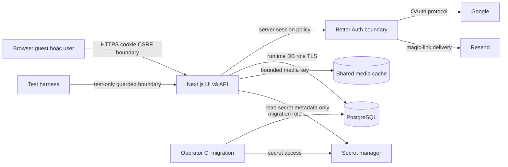

# TikPlay — Kế hoạch Quality, Security và Release cho Multi-auth

- **Trạng thái:** Kế hoạch kiểm định và phát hành đề xuất
- **Workstream:** D — Quality, security và rollout
- **Phạm vi:** Chiến lược kiểm thử, threat model, validation migration, observability và release gates; không thay đổi source code hoặc test code
- **Nguồn chuẩn:** [`PRD.md`](../PRD.md), [`docs/auth-foundation-plan.md`](auth-foundation-plan.md), [`docs/auth-ux-plan.md`](auth-ux-plan.md), [`AGENTS.md`](../AGENTS.md), [`playwright.config.ts`](../playwright.config.ts), test suite dưới [`e2e`](../e2e), [`lib/adminAuth.ts`](../lib/adminAuth.ts), và route inventory dưới [`app/api`](../app/api)
- **Quyết định kế thừa:** Better Auth, Drizzle, managed PostgreSQL, Google, Resend magic link, session database-backed, legacy tracks là global catalog, selected legacy playlists là editorial, account soft-delete 30 ngày, listening history retention 180 ngày

## 1. Mục tiêu chất lượng và nguyên tắc bất biến

Multi-auth chỉ được bật cho production khi các thuộc tính sau được chứng minh bằng automated test, kiểm tra cấu hình và rehearsal vận hành:

1. **Guest-first:** guest browse/process/play không bị sign-in wall và không ghi dữ liệu cá nhân vào account bất kỳ.
2. **Identity integrity:** OAuth callback, magic link và session không thể bị replay, fixation, redirect abuse hoặc email-only auto-link.
3. **Server-enforced ownership:** mọi private read/write lấy user từ server session; route/payload ID không thể vượt ownership.
4. **Private by default:** private response không cache công khai; lỗi không tiết lộ sự tồn tại của resource thuộc user khác.
5. **No silent loss/duplication:** deployment migration và guest import có dry run, idempotency, reconciliation và recovery path.
6. **Playback continuity:** auth, sign-out, expiry, revoke và deletion không remount audio engine hoặc dừng public/cacheable media không cần thiết.
7. **Immediate access revocation:** revoked, expired hoặc soft-deleted session bị từ chối ở request kế tiếp trong bounded propagation window.
8. **Privacy control correctness:** history clear, personalization opt-out, export và deletion áp dụng đúng user, đúng retention và không làm hỏng shared media.
9. **Operational safety:** rollback sau khi personal writes bắt đầu không bao giờ chép dữ liệu riêng tư trở lại shared JSON.
10. **Evidence-based release:** mọi acceptance criterion có test ID, owner, artifact và go/no-go result.

## 2. Release blockers hiện tại

Các vấn đề dưới đây tồn tại trong baseline và chặn mọi public multi-user rollout, kể cả rollout phần trăm nhỏ.

### RB-01 — Admin authentication còn dựa trên static bearer/header token

[`isAdminRequest()`](../lib/adminAuth.ts:4) chấp nhận `Authorization: Bearer` hoặc `x-admin-token` dùng chung. Cơ chế timing-safe compare giảm timing leak nhưng không cung cấp identity riêng, session revocation theo operator, CSRF model cho browser admin, role freshness hoặc audit attribution.

**Điều kiện đóng blocker:**

- Admin routes dùng server-resolved session và fresh `admin` role; client không chọn role/user.
- Dangerous transitional mode, nếu bắt buộc, yêu cầu đồng thời admin session và `ADMIN_TOKEN`, nằm sau feature flag có ngày gỡ bỏ; không dùng token-only trong production multi-auth.
- Mọi admin mutation có CSRF protection, audit actor/session, request ID và reason/outcome.
- `ADMIN_TOKEN` không xuất hiện trong URL, browser storage, response, analytics hoặc logs; có rotation/revocation runbook.
- Test `SEC-ADM-*` và `E2E-ADM-*` pass; route inventory không còn public destructive/admin mutation.

### RB-02 — YouTube cookies endpoint chưa được bảo vệ

[`GET()`](../app/api/admin/youtube-cookies/route.ts:10) công khai metadata và [`POST()`](../app/api/admin/youtube-cookies/route.ts:14) nhận rồi lưu cookie material mà không auth/role/CSRF. Đây là đường secret injection và operational account compromise.

**Điều kiện đóng blocker:**

- Cả GET/POST yêu cầu admin role; POST có CSRF/origin enforcement và strict payload bounds.
- Cookie content chuyển sang secret manager hoặc encrypted dedicated store; GET không bao giờ trả plaintext/base64/token-like content.
- Logs/audit chỉ chứa safe metadata như version, updatedAt, actor và outcome; không chứa filename nhạy cảm hoặc cookie body.
- Unauthorized/ordinary-user/cross-origin requests không làm thay đổi state và trả stable denial.
- Tests `SEC-ADM-001..006` pass ở staging với log-capture assertion.

### RB-03 — Destructive track health endpoint đang public

[`GET()`](../app/api/tracks/health/route.ts:8) lộ filesystem/catalog diagnostics; [`POST()`](../app/api/tracks/health/route.ts:62) cho phép xóa track rows và cache files không auth. Existing [`e2e/library-health.spec.ts`](../e2e/library-health.spec.ts) hiện còn xác nhận public destructive behavior; test đó phải được thay đổi bởi implementation workstream trước release.

**Điều kiện đóng blocker:**

- GET và POST yêu cầu admin role; destructive action có CSRF, validation, impact preview/confirmation contract và audit.
- Track/file đang được reference không bị xóa trái policy; path/key không thể tạo path traversal.
- Guest và normal user nhận denial; malformed/mixed IDs không gây partial unauthorized deletion.
- Cleanup có dry-run hoặc bounded target set, idempotent result và observable counts.
- Tests `SEC-HLT-*` và `E2E-ADM-007..011` pass; không còn test mong đợi anonymous cleanup thành công.

### RB-04 — Global track mutation đang public

[`POST()`](../app/api/tracks/route.ts:49), [`PATCH()`](../app/api/tracks/route.ts:65) và [`DELETE()`](../app/api/tracks/route.ts:158) đang mutate global tracks không auth. Trong multi-user model, ordinary user chỉ được mutate membership/per-user metadata; global catalog mutation là admin-only.

**Điều kiện đóng blocker:** split public catalog, authenticated membership và admin catalog mutation; prove bằng route-level authorization matrix và cross-user tests trước cutover.

## 3. Threat model

### 3.1 Assets

- Session cookies/tokens, OAuth state/nonce/PKCE artifacts, verification token và provider token.
- User identity, linked accounts, role, session inventory và audit events.
- Private library, favorites, playlists, rules, preferences, history, import snapshots và exports.
- Global catalog/media cache, blocked-media/legal records và operational YouTube cookies.
- PostgreSQL credentials/backups, auth/email/provider secrets và migration artifacts.
- Playback state cần continuity nhưng không được giữ private metadata sau identity transition.

### 3.2 Actors

- Guest hợp lệ; authenticated user A/B; admin; deployment/migration operator.
- Attacker không đăng nhập; malicious authenticated user; compromised/revoked session holder.
- OAuth/magic-link phisher; bot/rate-limit abuser; malicious site thực hiện CSRF/open redirect.
- Compromised browser extension/device; insider có log/backup access; dependency/provider outage hoặc compromise.

### 3.3 Trust boundaries

| Boundary                                    | Dữ liệu qua biên                                      | Threat chính                                                 | Bằng chứng bắt buộc                                                              |
| ------------------------------------------- | ----------------------------------------------------- | ------------------------------------------------------------ | -------------------------------------------------------------------------------- |
| Browser ↔ Next.js                           | Cookie, form/API payload, return intent               | XSS/token theft, CSRF, IDOR, replay, oversized payload       | Cookie/header inspection, CSRF tests, payload fuzz/bounds, ownership matrix      |
| Next.js ↔ Better Auth                       | Session lookup, callback, verification                | Session fixation, stale role, callback confusion             | auth helper integration tests, callback correlation, revoke/expiry tests         |
| Better Auth ↔ Google                        | state, nonce, PKCE, code, claims                      | forged callback, state reuse, email collision, open redirect | deterministic provider boundary suite + one real staging smoke                   |
| Better Auth ↔ Resend                        | recipient, one-time URL, delivery events              | enumeration, token leakage/replay, mail abuse                | capture transport suite, generic response comparison, redacted logs              |
| Next.js ↔ PostgreSQL                        | identity/ownership/personal records                   | missing owner predicate, transaction race, injection         | repository integration tests on real PostgreSQL, query constraints, two-user E2E |
| Next.js ↔ media cache                       | global media files/keys                               | traversal, unauthorized deletion, privacy metadata leak      | key validation and destructive admin route tests                                 |
| Runtime/CI ↔ secrets                        | DB/auth/provider/email/admin secrets                  | secret leakage, privilege escalation                         | config scanner, least-privilege review, rotation drill                           |
| Migration operator ↔ PostgreSQL/JSON backup | legacy catalog/compliance data                        | loss, duplication, wrong attribution, rollback corruption    | dry-run manifest, source hash, reconciliation report, restore drill              |
| Test harness ↔ app                          | test identities, captured mail, session clock/control | test backdoor exposed in production                          | compile/deploy guard, environment allowlist, negative production probe           |

### 3.4 Abuse cases và required controls

| ID    | Abuse case                                                           | Tác động                           | Prevent/Detect controls                                                          | Required tests                         |
| ----- | -------------------------------------------------------------------- | ---------------------------------- | -------------------------------------------------------------------------------- | -------------------------------------- |
| TM-01 | Đổi `userId`, playlist/resource ID để đọc/sửa dữ liệu user B         | Critical privacy breach            | Ignore client owner; ownership-constrained query; private resource trả 404       | `INT-AUTHZ-*`, `E2E-ISO-*`             |
| TM-02 | Replay OAuth callback/state hoặc callback không có matching flow     | Account/session compromise         | State+nonce+PKCE, atomic consumption, short TTL, allowlisted origin              | `INT-GGL-003..006`                     |
| TM-03 | Auto-link Google và magic-link account chỉ vì email giống nhau       | Account takeover                   | Không automatic email-only linking; authenticated explicit link + reauth         | `INT-GGL-007`, `E2E-GGL-006`           |
| TM-04 | Dùng lại hoặc dùng magic link hết hạn                                | Unauthorized access                | 15-minute TTL, atomic single-use, generic error                                  | `INT-ML-004..008`, `E2E-ML-004..006`   |
| TM-05 | Enumerate account qua response/timing magic-link                     | Privacy leak                       | Generic status/body, comparable processing path, email-hash rate limit           | `SEC-ML-001..004`                      |
| TM-06 | CSRF protected mutation/admin/destructive action                     | Unauthorized mutation              | SameSite, origin validation, framework CSRF token/defense, no GET mutation       | `SEC-CSRF-*`, `E2E-ADM-*`              |
| TM-07 | Open redirect qua callback/`returnTo`                                | Phishing/token theft               | Exact origin và relative-path allowlist; reject encoded/protocol-relative URLs   | `SEC-REDIR-*`                          |
| TM-08 | Session fixation trước/sau login                                     | Account compromise                 | Rotate session on auth elevation; bind callback flow; clear stale cookie         | `INT-SES-001..003`                     |
| TM-09 | Revoke/expiry bị session cache trì hoãn                              | Continued private access           | DB-backed active check; bounded cache; no-store private responses                | `INT-SES-006..010`, `E2E-SES-*`        |
| TM-10 | Private response được CDN/browser cache và trả cho identity khác     | Cross-user leak                    | `private, no-store`, correct `Vary`; no cache of session payload                 | `SEC-CACHE-*`, `E2E-ISO-009`           |
| TM-11 | Import retry tạo duplicate hoặc key reused với payload khác          | Corruption/user distrust           | Unique user+key, payload hash, transaction, stored completed result              | `INT-IMP-*`, `E2E-IMP-*`               |
| TM-12 | Playlist conflict overwrite server playlist                          | Data loss                          | Preview, deterministic rename, no silent merge/overwrite                         | `INT-IMP-010..014`, `E2E-IMP-008..011` |
| TM-13 | Safe queued operation của A replay sau khi login B                   | Cross-account mutation             | Bind operation to session/user generation; require review/discard                | `E2E-PB-010`                           |
| TM-14 | Delete account nhưng session/account vẫn usable                      | Critical privacy failure           | Transactional soft-delete + revoke all + login guard + purge job                 | `INT-DEL-*`, `E2E-PRV-010..016`        |
| TM-15 | YouTube cookie injection/read hoặc health cleanup bởi anonymous/user | Operational compromise/destruction | Admin session/role, CSRF, secret store, audit, impact bounds                     | `SEC-ADM-*`, `SEC-HLT-*`               |
| TM-16 | Tokens/PII xuất hiện trong logs, analytics, URLs hoặc storage        | Credential/privacy leak            | Structured allowlist logging, redaction, no browser token storage                | `SEC-LOG-*`, artifact scan             |
| TM-17 | Import JSON gán global favorites/history cho mọi account             | Privacy/correctness failure        | Explicit policy assertions and zero-count user records                           | `MIG-DRY-*`, `MIG-REC-*`               |
| TM-18 | Rollback chép personal PostgreSQL data vào shared JSON               | Critical disclosure                | PostgreSQL remains authoritative; degraded write mode                            | `MIG-RBK-*`, operator rehearsal        |
| TM-19 | Test-only provider/mail/session controls bật ở production            | Auth bypass                        | Build/runtime environment guard, separate credentials, production negative probe | `SEC-TST-001..004`                     |
| TM-20 | Rate abuse gây mail flood, extraction/DB exhaustion                  | Cost/availability                  | Per-IP and normalized-email-hash limits, cooldown, quotas, saturation alerts     | `SEC-RATE-*`, load test                |

## 4. Security controls và release checklist

### 4.1 Authentication và identity

- [ ] Pin exact Better Auth/plugins; generated schema diff được review khi upgrade.
- [ ] Google state, nonce, PKCE và callback verification bật theo library guidance; state single-use và expiring.
- [ ] Session ID/token rotate sau successful authentication; anonymous pre-auth state không được promoted nguyên dạng.
- [ ] Chỉ Google và magic link bật trong MVP; password, Apple, passkey và implicit linking không bị bật ngoài ý muốn.
- [ ] Không auto-link dựa trên matching email; provider `(provider_id, account_id)` unique.
- [ ] Redirect/callback/origin allowlist exact-match; chỉ relative `returnTo` hợp lệ.
- [ ] Auth errors dùng stable reason code, không trả provider token/raw exception.

### 4.2 Magic link và email

- [ ] Token TTL 15 phút, single-use bằng atomic consume; replacement semantics được test.
- [ ] Request luôn generic cho existing/non-existing/deleted email.
- [ ] Rate limit theo IP và normalized-email hash; resend cooldown và hourly cap.
- [ ] Resend SPF/DKIM/DMARC, signed webhook verification, staging recipient guard.
- [ ] Token URL chỉ được tạo/gửi server-side; không analytics/log/browser storage.
- [ ] Bounce/complaint/delayed events không chứa raw token và có alert policy.

### 4.3 Session, cookie và browser security

- [ ] Production cookie `HttpOnly`, `Secure`, `Path=/`, không broad `Domain`, compatible `SameSite=Lax` hoặc stricter verified policy.
- [ ] Session validation reject expired, revoked, soft-deleted và purged users.
- [ ] Private/session responses `Cache-Control: private, no-store`; personalized variants không dùng public cache.
- [ ] Protected mutations có CSRF defense và origin enforcement; CORS không wildcard với credentials.
- [ ] OAuth/provider/session tokens không vào `localStorage`, `sessionStorage`, IndexedDB hoặc client-visible session payload.
- [ ] Security headers baseline: CSP phù hợp OAuth UI, `frame-ancestors`, MIME sniffing protection, referrer policy và HTTPS/HSTS ở production.

### 4.4 Authorization và data isolation

- [ ] Route inventory phân loại guest/optional-session/authenticated/owner/admin cho mọi method.
- [ ] Repository method yêu cầu authoritative `userId` từ auth context; không infer từ body/query.
- [ ] Ownership check và write cùng transaction/constrained SQL để tránh TOCTOU.
- [ ] Private foreign resource trả 404 khi cần chống existence leak; denial shape nhất quán.
- [ ] Role được đọc fresh từ DB, không tin client claim hoặc stale long-lived role.
- [ ] Favorites/library/playlist/rules/preferences/history/import/export/session/deletion đều có two-user negative tests.

### 4.5 Input, import và media safety

- [ ] UUID/ID, string, URL, list count, payload bytes, nested depth và time range có bounds.
- [ ] Guest snapshot schema versioned; không chứa token/email/history import; preview không mutate.
- [ ] Import idempotency unique theo user+key, hash-bound; transaction rollback hoàn toàn khi failure.
- [ ] Canonical URL/audio key dedupe deterministic; playlist rename deterministic; server playlist không overwrite.
- [ ] Media/cache keys chống traversal; ordinary user không xóa global track/file.
- [ ] Process/report/auth endpoints có abuse rate limits; error không phản chiếu secret URL details.

### 4.6 Admin, secrets và audit

- [ ] RB-01..RB-04 đóng trước production auth enablement.
- [ ] Runtime DB role chỉ DML; migration role riêng cho reviewed DDL; TLS verification bật.
- [ ] Secret chỉ trong secret manager, tách dev/staging/prod; rotation procedure được rehearsal.
- [ ] YouTube cookie contents không nằm trong general DB/API/log; GET chỉ safe metadata.
- [ ] Admin/destructive actions có actor/session/request ID, action, target, outcome, count; không raw secret.
- [ ] Audit retention 365 ngày được Privacy/Legal duyệt; access tới audit logs được kiểm soát.

### 4.7 Privacy và deletion

- [ ] Listening events purge sau 180 ngày; personalization off không ghi/dùng history theo approved contract.
- [ ] History clear chỉ xóa user hiện tại, idempotent, không ảnh hưởng playback/shared media.
- [ ] Export chỉ thuộc requesting user, download same-origin/short-lived, không leak token qua query/referrer.
- [ ] Deletion transaction set soft-delete và revoke all ngay; login/link bị chặn trong 30-day window.
- [ ] Purge job idempotent, cascade personal records, preserve shared catalog/media và emit aggregate safe result.
- [ ] Log/analytics scan không có raw email, token, magic-link URL, source secret hoặc detailed listening history.

## 5. Test pyramid và suite ownership

| Tầng                    | Mục tiêu                                                                                                                         | Công cụ/DB                                                              | Chạy khi nào                               | Release expectation                       |
| ----------------------- | -------------------------------------------------------------------------------------------------------------------------------- | ----------------------------------------------------------------------- | ------------------------------------------ | ----------------------------------------- |
| Static/config           | Types, schema/config invariant, secret/test-hook guard                                                                           | TypeScript, Biome, config validation                                    | Mọi PR                                     | 100% pass                                 |
| Unit                    | Pure policy: redirect allowlist, normalization, ranking, conflict naming, error mapping, prompt/queue rules                      | Test runner không network                                               | Mọi PR                                     | Fast, deterministic, parallel-safe        |
| Integration             | Better Auth adapter/helper, repository ownership, transaction/idempotency, real PostgreSQL constraints, mail/provider boundaries | Disposable PostgreSQL schema/container; fake clock; injected transports | Mọi auth/data PR                           | Bao phủ mọi protected route/policy branch |
| API contract/security   | HTTP method/status/error/cache/cookie/CSRF/rate limit, role/IDOR matrix                                                          | Built app + isolated DB                                                 | Mọi route PR; nightly abuse variants       | Không unresolved public mutation          |
| Component/accessibility | Auth/import/account states, keyboard/focus/live region/i18n                                                                      | Browser DOM/component runner                                            | UI PR                                      | Critical states và accessibility pass     |
| E2E                     | User journeys, two contexts, reload/tab/session transitions/playback                                                             | Playwright built app + deterministic providers                          | Merge gate; focused suites                 | Critical matrix 100% pass, retries 0      |
| Staging smoke           | Real Google/Resend, managed DB/TLS, callbacks, rollback flag                                                                     | Dedicated synthetic accounts/domain                                     | Pre-release và post-deploy                 | Không dùng làm primary regression suite   |
| Operational rehearsal   | Migration, restore/PITR, degraded mode, secret rotation, purge                                                                   | Staging clone/isolated environment                                      | Trước first rollout và destructive changes | Signed artifacts/runbook evidence         |

Không đưa toàn bộ auth correctness vào Playwright. Token consumption, transaction races, hash mismatch, cookie attributes và authorization branches phải được chứng minh chủ yếu ở integration/API layer; E2E tập trung vào wiring và user-visible invariants.

## 6. Deterministic auth-provider test strategy

### 6.1 Nguyên tắc

1. CI không gọi Google hoặc gửi email thật.
2. Better Auth vẫn chạy thật với real adapter/schema/session cookie; chỉ provider transport/clock/mail boundary được thay thế.
3. Test controls chỉ tồn tại trong explicit test environment, dùng random per-run control secret hoặc internal process injection; production build/start phải fail nếu test mode được bật.
4. Không dùng hand-crafted auth cookie làm primary path. Session fixture có thể seed DB qua privileged fixture API/helper, nhưng ít nhất callback/login suites phải đi qua auth protocol boundary.
5. Fake clock điều khiển state/magic-link/session expiry mà không chờ thời gian thật.

### 6.2 Google boundary

Implementer cung cấp injected OAuth adapter hoặc local deterministic OIDC boundary có các scenario cố định:

- valid authorization/code exchange với stable issuer/audience/sub/email/verified claim;
- user cancel/access denied;
- invalid/reused state;
- nonce mismatch;
- PKCE verifier mismatch;
- invalid issuer/audience/signature;
- code replay;
- same email nhưng different provider subject/identity conflict;
- transient token endpoint error và timeout.

Callback vẫn phải qua browser redirect tới app allowlisted callback. Test assert session cookie attributes, session rotation, minimized session response và no token in URL/storage/logs. Một real Google staging smoke dùng dedicated test OAuth app và synthetic account để phát hiện provider/config drift; smoke này serial, không chạy trên pull request và không thay thế boundary tests.

### 6.3 Magic-link boundary

Inject capture mail transport thay Resend trong CI. Fixture API/helper trả message metadata/token URL cho đúng test run và recipient alias nhưng không expose cross-run mail. Scenarios:

- request existing/new/deleted address cùng generic HTTP response;
- inspect generated URL chỉ trong privileged test process;
- successful consume, second consume, expiry qua fake clock;
- replacement/resend semantics và cooldown;
- malformed token, wrong origin và changed callback;
- delivery accepted/delayed/bounced/failed mapping;
- parallel consume chỉ một transaction thành công.

Production staging smoke gửi tới allowlisted synthetic mailbox trên verified non-production domain, đo request→delivery→completion và xóa mail artifact sau run.

### 6.4 Session controls

Fixture layer phải tạo/list/expire/revoke session theo API/DB helper có guard, không sửa browser cookie tùy tiện. Clock advancement hoặc explicit test-only DB setup dùng cho expiry. Cross-tab/device tests dùng hai browser contexts với separate storage state; revoke luôn qua product API trừ test integration cấp thấp.

### 6.5 Required test-hook safeguards

- `NODE_ENV` và explicit environment allowlist cùng bắt buộc; production startup từ chối test provider/mail/clock/fixture flags.
- Test control endpoint, nếu có, bind secret per run, không public route namespace thông thường, và bị absent/404 trong production artifact.
- CI logs không in captured URL/token; artifact chỉ giữ redacted message ID/hash.
- `SEC-TST-001`: production build không chứa reachable control endpoint.
- `SEC-TST-002`: production startup fail với test auth flag.
- `SEC-TST-003`: request không control secret bị deny.
- `SEC-TST-004`: fixture của run A không đọc/mutate run B.

## 7. Fixtures và test-data isolation

### 7.1 Per-run isolation

- Mỗi run có `runId` random; tạo PostgreSQL database/schema riêng hoặc namespace đã chứng minh FK/unique isolation.
- Mỗi worker/test nhận deterministic suffix; dù [`playwright.config.ts`](../playwright.config.ts) hiện `fullyParallel: false`, fixture không được phụ thuộc serial execution để đúng.
- Seed tối thiểu: guest, user A, user B, admin; hai sessions cho A; catalog tracks dùng UUID/audio keys riêng; private playlists của A/B; one editorial playlist.
- Email alias dùng reserved test domain và run ID; không dùng email cá nhân.
- Media fixture là tiny local deterministic file/metadata, không gọi TikTok/`yt-dlp`; real network extraction nằm trong riêng nightly smoke.
- Fake timestamps luôn UTC và quanh fixed epoch; scenario expiry/retention advance clock thay vì sleep.

### 7.2 Fixture contracts

| Fixture                         | Nội dung                                                   | Guardrail                               |
| ------------------------------- | ---------------------------------------------------------- | --------------------------------------- |
| `guestContext`                  | terms accepted tùy test, versioned guest snapshot optional | Không auth cookie                       |
| `userAContext` / `userBContext` | Real DB session, separate browser context                  | Không share storage state               |
| `adminContext`                  | Admin DB role/session                                      | Không static token-only                 |
| `catalogFixture`                | Global tracks/media refs/editorial list                    | No personal ownership                   |
| `guestSnapshotFixture`          | Stable snapshot ID, tracks/favorites/playlists/conflicts   | Payload bounded, no history/token/email |
| `mailCaptureFixture`            | Test-run scoped message lookup                             | Privileged process only, redact token   |
| `authClockFixture`              | Fixed now + controlled advance                             | Test-only startup guard                 |
| `auditCaptureFixture`           | Structured log/audit sink                                  | Assert absence of sensitive fields      |

### 7.3 Cleanup và contamination detection

- Preferred cleanup là drop per-run schema/database; row-by-row cleanup chỉ fallback.
- Media files đặt trong run-specific temp cache, canonical path checked trước recursive cleanup.
- `afterAll` cleanup không che test failure; CI finalizer cleanup abandoned runs theo TTL/tag.
- Post-suite assertion: không record ngoài run namespace bị thay đổi; no orphan imports/sessions/exports; fixture cache empty.
- Failure artifacts: screenshot/trace/network metadata được scrub cookie, authorization, email và callback query trước upload.
- Existing tests đang tạo/xóa shared rows qua public APIs và đọc [`data/tikplay.json`](../data/tikplay.json) không phù hợp multi-user isolation; implementation phải chuyển sang isolated fixture/API semantics trước release.

## 8. Detailed E2E matrix

### 8.1 Guest và auth entry

| Test ID     | Scenario                            | Assertions chính                                                      | Priority |
| ----------- | ----------------------------------- | --------------------------------------------------------------------- | -------- |
| E2E-GST-001 | First visit guest                   | Không auto auth modal/sign-in wall; public catalog visible            | P0       |
| E2E-GST-002 | Guest process/play local fixture    | Playback starts; no user/session required; no server personal history | P0       |
| E2E-GST-003 | Guest navigation while playing      | Một audio instance, same src, current time tăng                       | P0       |
| E2E-GST-004 | Value prompt trigger/dismiss        | Dismissible, local frequency cap, playback unaffected                 | P1       |
| E2E-GST-005 | Guest opens protected account route | Inline gate/no redirect loop; public player remains                   | P1       |
| E2E-GST-006 | Guest attempts protected mutation   | Auth value surface or stable 401; không tạo personal row              | P0       |

### 8.2 Google provider boundary

| Test ID     | Scenario                        | Assertions chính                                                    | Priority |
| ----------- | ------------------------------- | ------------------------------------------------------------------- | -------- |
| E2E-GGL-001 | Successful Google boundary flow | Callback creates correct account/session; return intent allowlisted | P0       |
| E2E-GGL-002 | Provider cancel                 | Recoverable UI, Google retry/email alternative, no session          | P1       |
| E2E-GGL-003 | Invalid/reused state            | Safe failure, no session/account, audit reason                      | P0       |
| E2E-GGL-004 | Nonce/PKCE mismatch             | Callback denied; no token/exception exposed                         | P0       |
| E2E-GGL-005 | Transient provider error        | Retry path, playback continues                                      | P1       |
| E2E-GGL-006 | Same email identity conflict    | Không auto-link; existing account không bị takeover                 | P0       |
| E2E-GGL-007 | Malicious `returnTo`            | Absolute/protocol-relative/encoded redirect rejected                | P0       |
| E2E-GGL-008 | Auth persistence                | Secure session persists reload và second tab                        | P0       |

### 8.3 Magic link

| Test ID    | Scenario                       | Assertions chính                                                       | Priority |
| ---------- | ------------------------------ | ---------------------------------------------------------------------- | -------- |
| E2E-ML-001 | Request and consume valid link | Generic request response; callback authenticates; waiting tab resolves | P0       |
| E2E-ML-002 | Unknown versus known email     | Same public status/body/copy; no existence disclosure                  | P0       |
| E2E-ML-003 | New account by verified link   | User/session created once; email verified                              | P0       |
| E2E-ML-004 | Expired link                   | No session; localized recoverable resend action                        | P0       |
| E2E-ML-005 | Used link replay               | Second use denied; original session unaffected                         | P0       |
| E2E-ML-006 | Concurrent consume             | Exactly one success and one safe failure                               | P0       |
| E2E-ML-007 | Resend cooldown/rate limit     | Generic response, retry metadata/copy, no mail flood                   | P1       |
| E2E-ML-008 | Delivery transient failure     | Safe error/waiting alternative; no raw provider error                  | P1       |
| E2E-ML-009 | Callback in second tab         | Origin tab re-resolves without duplicate post-auth/import              | P1       |

### 8.4 Two-user isolation và authorization

Mỗi resource suite phải thử cả read, create/update, delete, reorder/action, guessed ID và client-supplied `userId`.

| Test ID     | Scenario                              | Assertions chính                                                     | Priority |
| ----------- | ------------------------------------- | -------------------------------------------------------------------- | -------- |
| E2E-ISO-001 | A/B library                           | A không thấy/mutate membership B và ngược lại                        | P0       |
| E2E-ISO-002 | A/B favorites                         | Explicit set/unset chỉ user hiện tại; payload owner ignored/rejected | P0       |
| E2E-ISO-003 | A/B private playlist read             | Foreign ID trả 404/safe denial, không leak name/count                | P0       |
| E2E-ISO-004 | A/B playlist rename/delete            | No mutation, version/timestamps của B unchanged                      | P0       |
| E2E-ISO-005 | A/B playlist track add/remove/reorder | Exact membership/order của B unchanged                               | P0       |
| E2E-ISO-006 | A/B rules/preferences/history         | Foreign IDs/body owner không vượt scope                              | P0       |
| E2E-ISO-007 | A/B import/status                     | Import key/status/result scoped by current user                      | P0       |
| E2E-ISO-008 | A/B session/export/deletion           | A không list/revoke/download/delete B                                | P0       |
| E2E-ISO-009 | Cache identity switch                 | Response B không chứa cached private fields của A; no-store headers  | P0       |
| E2E-ISO-010 | Stale request after account switch    | Late A response bị discard, không render trong B UI                  | P0       |

### 8.5 Guest import, idempotency và conflicts

| Test ID     | Scenario                          | Assertions chính                                                               | Priority |
| ----------- | --------------------------------- | ------------------------------------------------------------------------------ | -------- |
| E2E-IMP-001 | Import offer after first auth     | Explicit summary và Import all/Choose/Not now                                  | P0       |
| E2E-IMP-002 | Defer and resume                  | Snapshot giữ nguyên; account menu resume được                                  | P1       |
| E2E-IMP-003 | Preview no mutation               | DB personal counts unchanged trước commit                                      | P0       |
| E2E-IMP-004 | Commit once                       | Imported/skipped/renamed counts đúng; order preserved                          | P0       |
| E2E-IMP-005 | Retry same key/same payload       | Stored result giống nhau; no duplicate rows/count increment                    | P0       |
| E2E-IMP-006 | Same key/different payload        | `IDEMPOTENCY_PAYLOAD_MISMATCH`; no partial write                               | P0       |
| E2E-IMP-007 | Concurrent same commit            | One logical import, deterministic shared result                                | P0       |
| E2E-IMP-008 | Duplicate track                   | Membership deduped by canonical URL/audio key; favorite/playlist links correct | P0       |
| E2E-IMP-009 | Playlist name conflict            | Existing server list unchanged; imported list renamed deterministically        | P0       |
| E2E-IMP-010 | Multiple suffix conflicts         | Stable numbered suffix and stable retry result                                 | P1       |
| E2E-IMP-011 | Preference conflict               | Default keeps account setting; selected device override only requested fields  | P1       |
| E2E-IMP-012 | Stale preview                     | Commit rejected with `PREVIEW_STALE`; requires review                          | P0       |
| E2E-IMP-013 | Mid-import failure                | Transaction rolls back; recovery snapshot retained; retry succeeds             | P0       |
| E2E-IMP-014 | Reload while processing/completed | Status recovered; completed import not offered/count twice                     | P1       |
| E2E-IMP-015 | Oversized/corrupt snapshot        | Validation error, no mutation, UI recovery; no server crash                    | P0       |

### 8.6 Session persistence, expiry và revocation

| Test ID     | Scenario                  | Assertions chính                                            | Priority |
| ----------- | ------------------------- | ----------------------------------------------------------- | -------- |
| E2E-SES-001 | Reload and new tab        | Same account resolved; cookie not readable by JS            | P0       |
| E2E-SES-002 | Expiry via fake clock     | Next protected request 401; one non-blocking prompt         | P0       |
| E2E-SES-003 | Reauth same user          | Data rehydrates; each safe queued operation replay once     | P0       |
| E2E-SES-004 | Reauth different user     | Old queue not replayed; review/discard notice               | P0       |
| E2E-SES-005 | Revoke other session      | Target context loses access; current context remains active | P0       |
| E2E-SES-006 | Revoke current session    | Current context tears down to guest; playback stays         | P0       |
| E2E-SES-007 | Revoke others             | Current retained, exact count, already-revoked idempotent   | P1       |
| E2E-SES-008 | Cross-tab sign-out/revoke | Tabs clear private state; no repeated modal storm           | P0       |
| E2E-SES-009 | Revoked cookie replay     | Protected API denied, no cache bypass                       | P0       |
| E2E-SES-010 | Soft-deleted user session | All old sessions denied; new login blocked per policy       | P0       |

### 8.7 Playback continuity

Dùng tracked audio fixture pattern tương tự [`e2e/global-playback.spec.ts`](../e2e/global-playback.spec.ts), nhưng khởi tạo track qua isolated catalog fixture thay vì public global mutation.

| Test ID    | Identity transition while playing   | Assertions chính                                                    | Priority |
| ---------- | ----------------------------------- | ------------------------------------------------------------------- | -------- |
| E2E-PB-001 | Open/complete Google auth           | Audio instance count 1, same src, not paused, time increases        | P0       |
| E2E-PB-002 | Complete magic link cross-tab       | Playback in origin tab continuous                                   | P0       |
| E2E-PB-003 | Sign out                            | Player state/queue/volume/speed/EQ preserved; private cache cleared | P0       |
| E2E-PB-004 | Session expiry                      | Audio/public controls continue; non-blocking banner                 | P0       |
| E2E-PB-005 | Current session revoke              | Same continuity invariants                                          | P0       |
| E2E-PB-006 | Account deletion                    | Public/cacheable current media continues; user actions removed      | P0       |
| E2E-PB-007 | Account route navigation            | Root provider not remounted; one audio engine                       | P0       |
| E2E-PB-008 | Late private request after sign-out | Response discarded; audio/media request không abort                 | P0       |
| E2E-PB-009 | Safe operation expiry/replay        | Operation once; playback uninterrupted                              | P1       |
| E2E-PB-010 | Reauth as different account         | No cross-account replay/private attribution; playback continuous    | P0       |

### 8.8 Privacy, personalization và deletion

| Test ID     | Scenario                          | Assertions chính                                               | Priority |
| ----------- | --------------------------------- | -------------------------------------------------------------- | -------- |
| E2E-PRV-001 | Disable personalization           | Editorial fallback ngay; library/playback vẫn hoạt động        | P0       |
| E2E-PRV-002 | History recording disabled policy | No new history-derived recommendation/event per contract       | P0       |
| E2E-PRV-003 | Clear history                     | Only current user deleted; idempotent; playback unaffected     | P0       |
| E2E-PRV-004 | Recommendation reason             | Approved reason code/copy; no sensitive detailed history       | P1       |
| E2E-PRV-005 | Insufficient history              | Deterministic editorial/category fallback, no misleading label | P1       |
| E2E-PRV-006 | Export ownership                  | Export contains only user records; B cannot download A         | P0       |
| E2E-PRV-007 | Export expiration                 | Expired link denied; no token leak in URL/referrer/log         | P1       |
| E2E-PRV-008 | Deletion confirmation             | Reauth/ack required; clear 30-day copy                         | P0       |
| E2E-PRV-009 | Deletion request atomicity        | Soft-delete and revoke all occur together                      | P0       |
| E2E-PRV-010 | Access after deletion             | Protected access/login denied; guest playback available        | P0       |
| E2E-PRV-011 | Purge before due                  | No deletion before `purgeAfter`                                | P0       |
| E2E-PRV-012 | Purge at/after due                | Personal rows removed; shared track/media preserved            | P0       |
| E2E-PRV-013 | Purge retry                       | Idempotent aggregate result, no resurrection/error leak        | P1       |
| E2E-PRV-014 | Audit/log privacy                 | No raw email/token/history in captured logs/artifacts          | P0       |

### 8.9 Admin blockers

| Test ID     | Scenario                             | Assertions chính                                       | Priority   |
| ----------- | ------------------------------------ | ------------------------------------------------------ | ---------- |
| E2E-ADM-001 | Guest/normal user YouTube cookie GET | Denied; no metadata/secret leak                        | P0 blocker |
| E2E-ADM-002 | Guest/normal user cookie POST        | Denied; stored value unchanged                         | P0 blocker |
| E2E-ADM-003 | Admin cookie update                  | CSRF-safe success; API never returns contents; audited | P0 blocker |
| E2E-ADM-004 | Cross-origin admin cookie POST       | Denied; no mutation                                    | P0 blocker |
| E2E-ADM-005 | Token-only transitional request      | Denied when multi-auth production mode enabled         | P0 blocker |
| E2E-ADM-006 | Secret log scan                      | Cookie body/base64 absent in logs/traces               | P0 blocker |
| E2E-ADM-007 | Guest/normal health GET              | Denied; filesystem diagnostics hidden                  | P0 blocker |
| E2E-ADM-008 | Guest/normal cleanup/delete          | Denied; DB/files unchanged                             | P0 blocker |
| E2E-ADM-009 | Admin cleanup dry-run/commit         | Bounded result, reference policy, audit counts         | P0 blocker |
| E2E-ADM-010 | Malformed IDs/path-like keys         | Validation; no partial deletion/traversal              | P0 blocker |
| E2E-ADM-011 | Admin role revoked mid-session       | Next operation denied due fresh role                   | P0 blocker |

## 9. Migration dry-run, reconciliation và rollback validation

### 9.1 Required artifacts

Mỗi rehearsal/production migration tạo immutable artifact bundle có access restriction:

- migration version, commit SHA, environment, operator identity và timestamps;
- source JSON SHA-256, file size, schema/version detection;
- pre-migration counts/orphans/collisions và cache key inventory hash;
- explicit editorial playlist allowlist hash;
- dry-run decisions: import/skip/fail counts theo entity và reason;
- post-import reconciliation report và sampled API/cache checks;
- DB schema migration IDs/checksums;
- backup/PITR reference nhưng không chứa credentials/raw sensitive content;
- signed go/no-go decision và rollback/degraded-mode result.

### 9.2 Dry-run test IDs và gates

| Test ID     | Validation                                          | Pass condition                                                    |
| ----------- | --------------------------------------------------- | ----------------------------------------------------------------- |
| MIG-DRY-001 | Parse representative production-copy JSON read-only | Source bytes/hash unchanged                                       |
| MIG-DRY-002 | Deterministic mapping rerun                         | Same IDs/counts/decisions for same version+hash                   |
| MIG-DRY-003 | Same migration name, changed source hash            | Hard fail before writes                                           |
| MIG-DRY-004 | Duplicate canonical URL/audio key                   | Deterministic dedupe; ambiguous collision blocks                  |
| MIG-DRY-005 | Orphan playlist/rule/compliance relationship        | Report complete; broken compliance relation blocks                |
| MIG-DRY-006 | Cache inventory                                     | Imported audio-key set maps to expected files; missing reported   |
| MIG-DRY-007 | Legacy policy                                       | All favorites/history/rules skipped as policy; no user fabricated |
| MIG-DRY-008 | Editorial allowlist                                 | Only explicit IDs imported, order normalized gap-free             |
| MIG-DRY-009 | YouTube cookie data                                 | Not inserted into normal PostgreSQL tables/artifacts              |
| MIG-DRY-010 | Malformed/range/payload bounds                      | Classified fail/skip exactly per approved policy                  |

### 9.3 Apply và reconciliation

| Test ID     | Validation                      | Pass condition                                                    |
| ----------- | ------------------------------- | ----------------------------------------------------------------- |
| MIG-REC-001 | Schema apply on empty DB        | All migrations/checks/FKs/indexes present                         |
| MIG-REC-002 | Schema upgrade on staging clone | No unexpected destructive DDL or runtime auto-migration           |
| MIG-REC-003 | Import rerun                    | Same completed result; no duplicate rows                          |
| MIG-REC-004 | Global tracks                   | Count after documented dedupe + complete audio-key/legacy mapping |
| MIG-REC-005 | Editorial playlists             | Count, membership and order exact                                 |
| MIG-REC-006 | Compliance/blocklist            | Counts/relationships/blocked behavior exact                       |
| MIG-REC-007 | Personal tables                 | Zero manufactured users/library/favorites/history/sessions        |
| MIG-REC-008 | Cache resolvability             | Sampled audio/cover reads pass without key rewrite                |
| MIG-REC-009 | API shadow comparison           | Approved public catalog fields equivalent after shape conversion  |
| MIG-REC-010 | Constraint probes               | Invalid ownership/duplicates/orphans rejected by DB               |

Count reconciliation không chỉ so tổng count: phải so set/hash của stable keys và relationships. Mọi unexplained delta là no-go; documented dedupe/skip có reason và source IDs.

### 9.4 Rollback/restore rehearsal

| Test ID     | Scenario                              | Expected result                                                                                       |
| ----------- | ------------------------------------- | ----------------------------------------------------------------------------------------------------- |
| MIG-RBK-001 | Schema-only deploy failure            | App rollback; JSON vẫn live; additive schema safe                                                     |
| MIG-RBK-002 | Catalog import trước protected writes | Global read flag quay về immutable JSON; PostgreSQL giữ để chẩn đoán                                  |
| MIG-RBK-003 | Failure sau personal writes enable    | PostgreSQL vẫn source of truth; protected writes vào degraded `503`; guest playback/catalog available |
| MIG-RBK-004 | PITR restore                          | Restore sang DB riêng, reconcile, atomic switch; không overwrite sole copy                            |
| MIG-RBK-005 | App release rollback                  | Last PostgreSQL-compatible release đọc được current schema/data                                       |
| MIG-RBK-006 | In-flight auth khi disable starts     | New starts disabled có kiểm soát; callback hợp lệ đang bay vẫn complete hoặc fail safely              |
| MIG-RBK-007 | Restore while session exists          | Session policy rõ: preserve validated sessions hoặc revoke-all; không ambiguous partial access        |
| MIG-RBK-008 | Accidental destructive cleanup        | Backup/cache recovery và audit target set được chứng minh                                             |
| MIG-RBK-009 | JSON contamination probe              | Không personal PostgreSQL row nào được ghi vào JSON                                                   |
| MIG-RBK-010 | Roll-forward after rollback           | Idempotent migration resumes from recorded status/source hash                                         |

Không drop column/table, remove legacy IDs, retire JSON backup hoặc remove transitional compatibility trong first auth release. Destructive cleanup là release riêng sau restore drill và rollback-window approval.

## 10. Observability, SLI/SLO và alerts

### 10.1 Telemetry contract

Mọi event/metric dùng low-cardinality dimensions: environment, provider, outcome/reason category, route group, status class và release version. Không label bằng user/session/email/resource ID. Request ID có thể dùng trong structured logs với access control, nhưng token/cookie/magic-link/source secret phải redacted trước sink.

Required signals:

- auth start/success/failure/cancel/conflict theo Google/magic link;
- magic-link request, provider accepted/delivered/delayed/bounced/complained và completion latency;
- session validation latency/error, expired/revoked/deleted denial;
- authorization denial theo policy/resource type, không target ID;
- guest import preview/commit/status duration, result counts, hash mismatch, retry/failure;
- DB pool saturation, transaction errors/deadlocks, migration status;
- session revoke, history clear, deletion request và purge job outcomes;
- admin/destructive action audit và denial spike;
- playback continuity synthetic result qua identity transition;
- privacy-safe client error category và auth surface recovery outcome.

### 10.2 Initial SLO targets

Các SLO là release baseline, review sau khi có traffic; không được nới gate chỉ để che incident.

| SLI                                               | Window                 | SLO                                                                 | Exclusions                                             |
| ------------------------------------------------- | ---------------------- | ------------------------------------------------------------------- | ------------------------------------------------------ |
| Session validation availability                   | Rolling 30 days        | ≥ 99.95% successful valid requests                                  | Client 4xx, intentional expired/revoked denials        |
| Session validation latency                        | Rolling 7 days         | p95 ≤ 150 ms, p99 ≤ 400 ms server-side                              | Cold deploy tracked separately, không silently exclude |
| Google auth completion                            | Rolling 7 days         | ≥ 99.0% với flows đến callback và không user-cancel                 | Explicit cancel, test traffic                          |
| Magic-link request acceptance                     | Rolling 7 days         | ≥ 99.9% server acceptance                                           | Rate-limited abuse                                     |
| Magic-link provider delivery                      | Rolling 7 days         | ≥ 98.0% accepted mail delivered, p95 ≤ 120 s                        | Hard bounce/complaint addresses reported separately    |
| Guest import completion                           | Rolling 7 days         | ≥ 99.5% valid commits complete; p95 ≤ 10 s cho approved max payload | Validation/conflict requiring user action              |
| Protected API authorization correctness synthetic | Continuous             | 100% two-user canary denials/pass                                   | Không exclusion                                        |
| Session revoke propagation                        | Continuous             | p99 ≤ 5 s tới next validation across contexts                       | Offline client UI refresh; API denial vẫn bắt buộc     |
| Account deletion access revocation                | Continuous             | 100% immediate transactional revoke                                 | Không exclusion                                        |
| Purge job timeliness                              | Daily                  | ≥ 99.9% due accounts purged trong 24h sau `purgeAfter`              | Legal hold nếu policy có và được audit                 |
| Guest playback availability                       | Rolling 30 days        | ≥ 99.9% cached/public media path                                    | Invalid/blocked media                                  |
| Playback continuity synthetic                     | Mỗi deploy + scheduled | 100% P0 identity transitions giữ audio invariant                    | Không exclusion                                        |

### 10.3 Alert policy

**Page immediately:** suspected cross-user access; authorization synthetic failure; admin cookie/health anonymous success; token/secret detection; deletion leaves session active; migration reconciliation mismatch; database corruption; error-budget burn ≥ 14× trong 1h cho auth/session.

**Urgent ticket/on-call notification:** 6× burn trong 6h; Google completion hoặc magic delivery dưới SLO; revoke p99 vượt 5s; DB pool > 80% sustained; import failure > 2% trong 15 phút; purge overdue; denial/rate-limit spike bất thường.

**Dashboard/review:** user cancel, expected expired links, prompt conversion và non-security UX errors. Không alert trên raw count mà không normalize traffic.

### 10.4 Synthetic probes

- Guest browse/play không auth.
- Google deterministic boundary callback trên staging.
- Magic-link capture/staging mailbox round trip.
- User A private playlist cannot be fetched with B session.
- Revoke secondary session then protected call denied.
- Admin cookie/health endpoints deny anonymous and ordinary user.
- Playback continues through expiry/sign-out synthetic transition.
- Due deletion fixture purge và shared track preservation.

## 11. Staged rollout

### Stage 0 — Blocker remediation và foundation verification

- Auth flag off; fix RB-01..RB-04.
- Pass static/unit/integration/API security suites, Better Auth compatibility spike và test-hook production guard.
- No-go nếu route inventory còn public mutation/global personal state hoặc secret endpoint.

### Stage 1 — Schema-only và migration shadow

- Apply additive schema; runtime vẫn dùng JSON cho existing paths.
- Run dry-run/import/shadow reconciliation trên staging clone, backup restore và PITR rehearsal.
- No-go khi source hash/count/set/relationship delta không giải thích được.

### Stage 2 — Internal admin/team allowlist

- Enable auth starts và PostgreSQL user paths chỉ cho team/synthetic users.
- Real staging Google/Resend smoke; two-user isolation; session revoke/deletion; playback transition.
- Observe ít nhất một full monitoring evaluation window đã thống nhất theo deployment cadence; quyết định dựa error budget chứ không dựa traffic thấp.

### Stage 3 — Production dark launch

- Deploy auth/session code, DB reads và telemetry nhưng không hiển thị public entry points; synthetic accounts only.
- Verify cookie/origin/redirect config trên canonical production origin, test hooks absent, no secret/log leaks.
- Callback endpoints phải xử lý an toàn dù public UI flag off.

### Stage 4 — Opt-in canary

- Mở account entry cho allowlisted cohort nhỏ; guest behavior unchanged.
- Tăng cohort theo config chỉ khi P0 suite, synthetics, SLO và reconciliation đều xanh.
- Không rollout guest import trước khi idempotency/conflict/recovery matrix pass.

### Stage 5 — Progressive public rollout

- Tăng lần lượt auth entry, protected user data, guest import, account/privacy, personalization bằng independent flags.
- Mỗi bước giữ kill switch cho new auth starts, imports, personalized modules và protected mutations; callbacks/session reads không tắt bừa.
- Nếu rollback sau personal writes: giữ PostgreSQL, serve guest/public, protected mutation trả recoverable `503`.

### Stage 6 — General availability và cleanup horizon

- Full public enablement sau go gate; monitor error budgets, privacy/admin synthetics và support signals.
- JSON retirement, `ADMIN_TOKEN` removal, legacy ID removal và destructive schema cleanup là follow-up release riêng.

## 12. Go/no-go gates

### Gate Q0 — Contract và blocker gate

- [ ] RB-01..RB-04 closed và evidence linked.
- [ ] Route access matrix đầy đủ mọi method; no unresolved anonymous/global personal mutation.
- [ ] Stable error/cache/cookie/session/import contracts frozen.
- [ ] Production artifact không có reachable test controls.

### Gate Q1 — Security gate

- [ ] Threats TM-01..20 có implemented controls và passing tests.
- [ ] P0 auth protocol, CSRF, redirect, IDOR, role, cache và log-redaction suites pass với retries 0.
- [ ] Independent review xác nhận no email-only linking, provider/session token exposure hoặc stale-role admin access.
- [ ] Dependency/security scan không có unaccepted critical/high finding trong reachable auth path.

### Gate Q2 — Data/migration gate

- [ ] `MIG-DRY-*`, `MIG-REC-*`, `MIG-RBK-*` pass trên staging clone.
- [ ] Backup restore/PITR evidence có owner sign-off.
- [ ] No legacy favorites/history/user attribution; shared cache keys và compliance relationships reconcile.
- [ ] Degraded-mode rollback giữ PostgreSQL personal truth.

### Gate Q3 — Functional/privacy gate

- [ ] Mọi P0 `E2E-GST/GGL/ML/ISO/IMP/SES/PB/PRV/ADM` pass.
- [ ] Two-user matrix bao phủ từng protected resource/method.
- [ ] Import concurrent retry/hash conflict và account deletion/purge pass.
- [ ] Accessibility critical paths: keyboard, focus restore/trap, live region, mobile target và 200% zoom pass.

### Gate Q4 — Operational gate

- [ ] Dashboards, SLO/error-budget alerts, runbooks và on-call ownership active.
- [ ] Real staging Google/Resend, managed DB TLS/pooling và secret rotation smoke pass.
- [ ] Synthetic isolation/admin/playback/deletion probes pass trước và sau deploy.
- [ ] Incident response đã rehearsal cho provider outage, DB outage, suspected IDOR và secret leak.

### Gate Q5 — Repository/build gate

- [ ] `npm run format`, `npm run lint`, `npx tsc --noEmit`, focused Playwright và `npm run build` pass theo [`AGENTS.md`](../AGENTS.md).
- [ ] Playwright chạy built app; CI không reuse stale incompatible server.
- [ ] Flake policy: P0 retries giữ 0; test fail không được rerun-until-green để cấp release.
- [ ] Traces/artifacts scrub sensitive data.

### Go decision

Release chỉ **GO** khi Q0–Q5 đều xanh và Product, A, B, C, D, Security/Privacy và operator ký evidence. Bất kỳ P0 failure, reconciliation delta, cross-user suspicion, blocker mở, secret leak hoặc missing rollback evidence là **NO-GO**. Không có waiver cho privacy isolation, admin destructive exposure, token handling, deletion revocation hoặc data-loss controls.

## 13. Acceptance criteria mapping

| AC    | Acceptance criterion                                  | Primary test IDs/evidence                                      | Owner     |
| ----- | ----------------------------------------------------- | -------------------------------------------------------------- | --------- |
| AC-01 | Guest browse/play không forced login                  | `E2E-GST-001..003`, `E2E-PB-007`                               | C/D       |
| AC-02 | Google và magic link hoạt động                        | `E2E-GGL-001..008`, `E2E-ML-001..009`, real staging smoke      | A/C/D     |
| AC-03 | Session persist securely across reload                | `E2E-GGL-008`, `E2E-SES-001`, `INT-SES-*`, cookie checklist    | A/D       |
| AC-04 | Guest import explicit, idempotent, reports conflicts  | `E2E-IMP-001..015`, `INT-IMP-*`                                | B/C/D     |
| AC-05 | Personal data isolated per user                       | `E2E-ISO-001..010`, repository integration matrix              | A/B/D     |
| AC-06 | Route/payload ID không truy cập private resource khác | `E2E-ISO-003..008`, `SEC-IDOR-*`                               | A/B/D     |
| AC-07 | Expiry/sign-out không crash/interruption playback     | `E2E-SES-002..010`, `E2E-PB-001..010`                          | C/D       |
| AC-08 | Session/privacy/deletion controls                     | `E2E-SES-005..010`, `E2E-PRV-001..014`, `INT-DEL-*`            | A/B/C/D   |
| AC-09 | Personalized fallback và reason deterministic         | `E2E-PRV-001..005`, ranking unit tests                         | B/C/D     |
| AC-10 | Required verification pass                            | Gate Q5 CI artifacts                                           | All/D     |
| AC-11 | Migration/auth secret deployment và rollback docs     | `MIG-DRY-*`, `MIG-REC-*`, `MIG-RBK-*`, secret/restore runbooks | A/B/D/Ops |

### Additional security acceptance mapping

| Security outcome                             | Test IDs/evidence                               |
| -------------------------------------------- | ----------------------------------------------- |
| Admin cookies protected/no secret response   | `SEC-ADM-001..006`, `E2E-ADM-001..006`          |
| Health/destructive route protected           | `SEC-HLT-*`, `E2E-ADM-007..011`                 |
| OAuth protocol integrity/no auto-link        | `INT-GGL-*`, `E2E-GGL-003..007`                 |
| Magic-link replay/enumeration resistance     | `INT-ML-*`, `SEC-ML-*`, `E2E-ML-002..007`       |
| CSRF/open redirect/cache controls            | `SEC-CSRF-*`, `SEC-REDIR-*`, `SEC-CACHE-*`      |
| No sensitive logging/test backdoor           | `SEC-LOG-*`, `SEC-TST-*`, `E2E-PRV-014`         |
| Migration no wrong attribution/rollback leak | `MIG-DRY-007`, `MIG-REC-007`, `MIG-RBK-003/009` |

## 14. CI execution policy và evidence

### Pull request

- Static/config, unit, affected integration/API contract/security tests.
- Focused Playwright suite theo feature; P0 auth/data route change phải chạy relevant two-user và playback transition tests.
- Schema change chạy empty DB apply, upgrade fixture và generated schema diff.

### Main branch/nightly

- Full deterministic Playwright matrix, concurrency/race variants, rate-limit tests, log/artifact scanner.
- Local media fixtures mặc định; real TikTok test tách network-dependent lane và không block auth correctness.
- Dependency/security scan và migration dry-run trên sanitized representative snapshot.

### Pre-release

- Build then full P0 suite with `retries: 0`.
- Staging real-provider smoke, restore/rollback/degraded-mode rehearsal, synthetic/admin negative probes.
- Generate release evidence manifest mapping commit → config hashes → migrations → test IDs → dashboards → approvals.

### Post-deploy

- Run guest, auth callback, isolation, revoke, admin denial và playback synthetics.
- Compare SLI/error-budget and denial/error distribution against canary baseline before cohort increase.
- Automatic/manual rollback trigger phải giữ callback safety và PostgreSQL personal truth.

## 15. Handoff plan cho implementation workstreams

- **A:** cung cấp deterministic Google/mail/session clock boundaries, production guards, session/role/CSRF/error contracts và integration hooks.
- **B:** cung cấp isolated database fixture, migration dry-run/reconcile outputs, user-scoped repository/API seeds và idempotent import controls.
- **C:** cung cấp stable accessible selectors/states, session-generation observability và playback-safe UI hooks; không expose token/test shortcuts.
- **D:** sở hữu test ID registry, Playwright/security suites, migration/rollback evidence, dashboards/SLO validation và go/no-go sign-off.
- **Ops/Security/Privacy:** sở hữu secret/DB/provider configuration, restore/rotation drill, alert routing, retention và deletion policy approval.

Implementation không được coi một test ID là hoàn thành chỉ vì test file tồn tại. Mỗi ID cần assertion trực tiếp lên security/user invariant, isolated fixture, deterministic setup, cleanup, và artifact trong release manifest.

## 16. Definition of done cho Workstream D

- [ ] Threat model và controls được A/B/C/Security review; mọi Critical/High threat có owner/test.
- [ ] RB-01..RB-04 đóng bằng code review và automated evidence trước production auth flag.
- [ ] Deterministic provider/mail/session fixtures hoạt động trong CI và không reachable ở production.
- [ ] P0 E2E matrix pass với two-user isolation, import races, revoke/expiry, playback và deletion.
- [ ] Migration dry-run/reconciliation/restore/degraded rollback rehearsal pass trên staging clone.
- [ ] SLO dashboards, burn-rate/security alerts, synthetics và runbooks active.
- [ ] Acceptance criteria AC-01..11 map tới passing test IDs/evidence.
- [ ] Q0–Q5 signed GO; no unresolved release blocker, sensitive artifact hoặc unexplained data delta.
