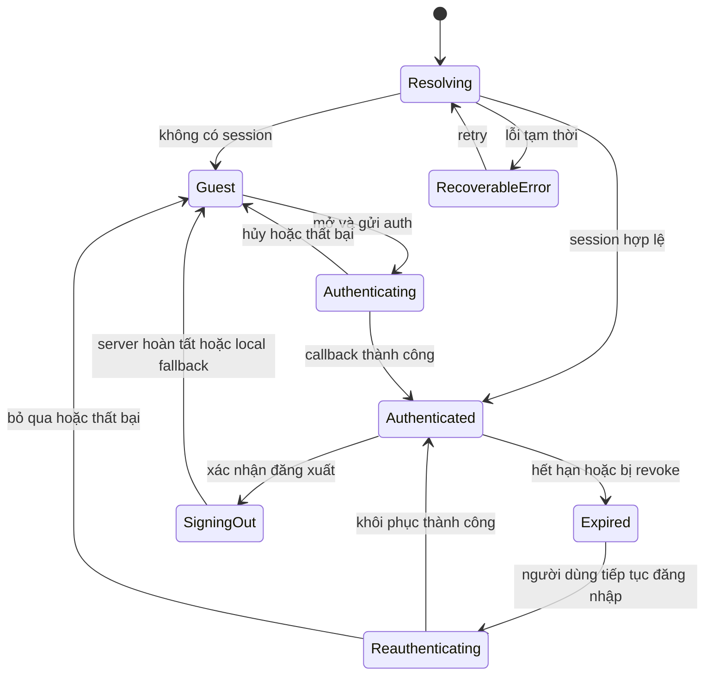
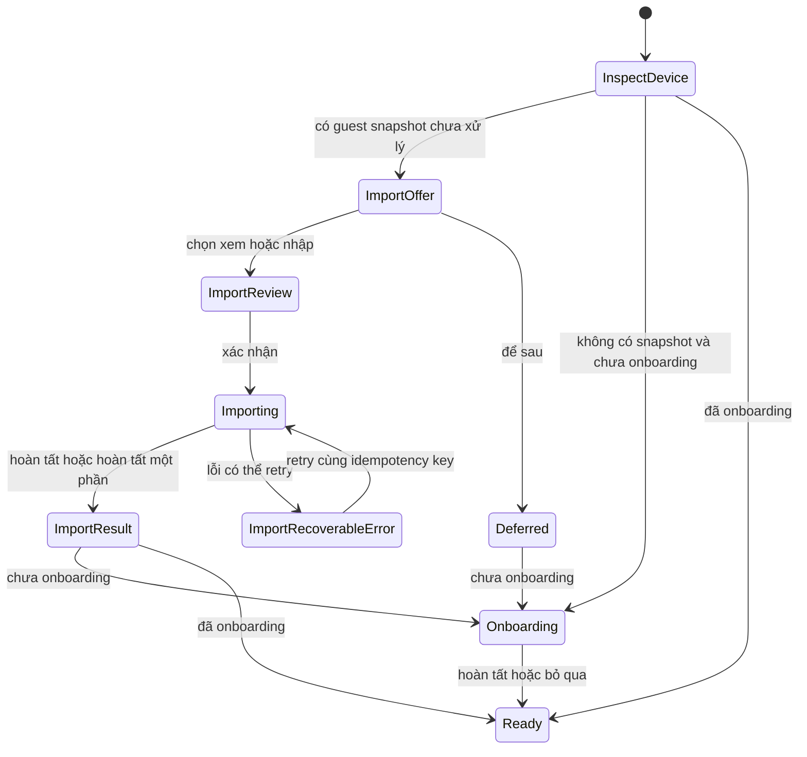
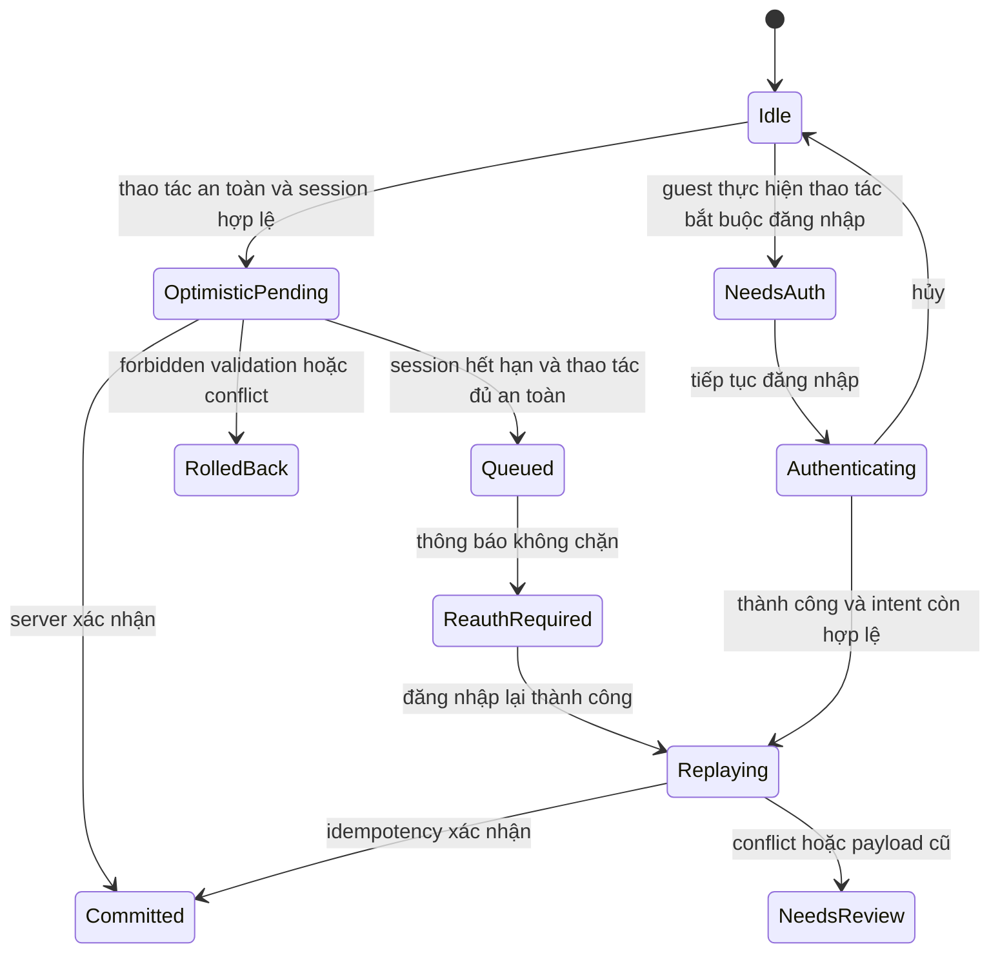
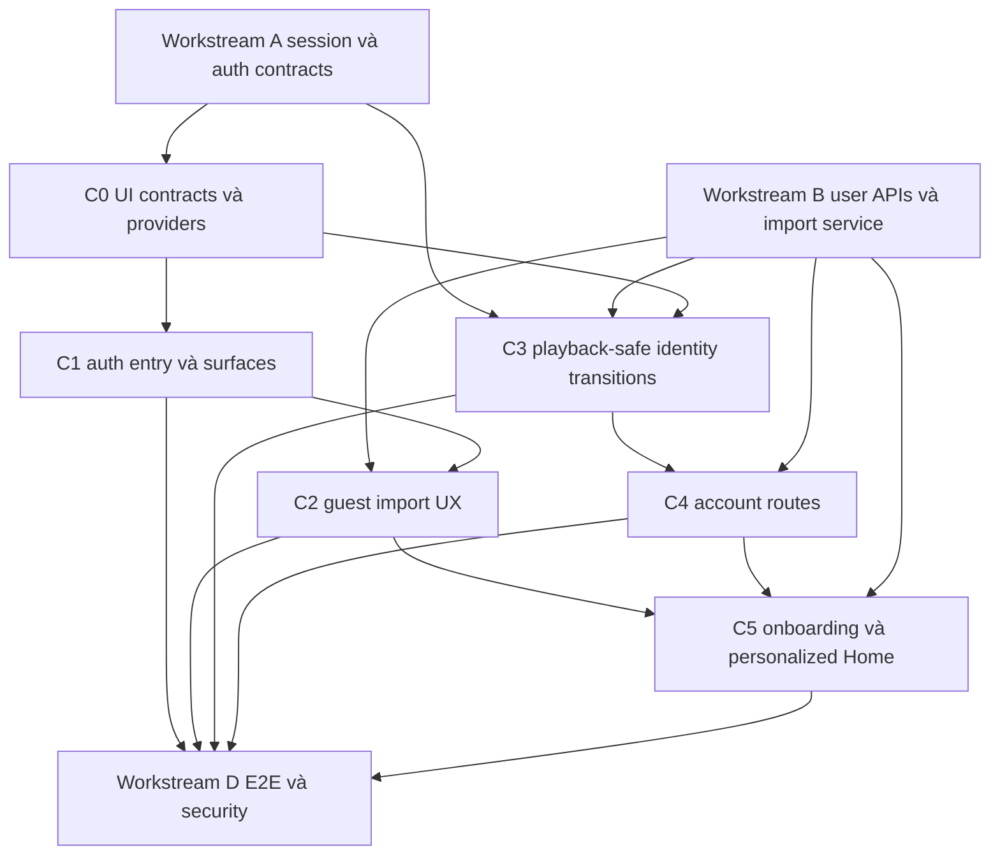

# TikPlay — Kế hoạch UX cho xác thực, tài khoản và cá nhân hóa

- **Trạng thái:** Kế hoạch triển khai đề xuất
- **Workstream:** C — Authentication and account UX
- **Phạm vi:** UX, kiến trúc frontend và hợp đồng tích hợp; không thay đổi source code
- **Ngôn ngữ mặc định:** Tiếng Việt (`vi-VN`), mọi chuỗi phải sẵn sàng cho i18n
- **Nguồn chuẩn:** [`PRD.md`](../PRD.md), [`docs/auth-foundation-plan.md`](auth-foundation-plan.md), [`docs/player-architecture.md`](player-architecture.md)

## 1. Mục tiêu và nguyên tắc thiết kế

### 1.1 Mục tiêu

1. Giữ TikPlay guest-first: người dùng có thể khám phá, xử lý URL và nghe nhạc mà không bị chặn bởi đăng nhập.
2. Chỉ mời đăng nhập tại thời điểm giá trị rõ ràng: đồng bộ, sao lưu, chia sẻ riêng tư hoặc sau khi đã tạo dữ liệu local có ý nghĩa.
3. Hỗ trợ Google và email magic link trong MVP; không hiển thị Apple/passkey trước khi backend thực sự hỗ trợ.
4. Nhập dữ liệu guest minh bạch, có preview, lựa chọn, xử lý xung đột và khả năng khôi phục.
5. Tách identity/user data khỏi playback runtime để đăng nhập, hết phiên và đăng xuất không làm dừng audio.
6. Đưa profile, preferences, sessions và privacy vào các route riêng, dùng chung account shell responsive.
7. Cá nhân hóa có lý do giải thích, fallback rõ ràng và quyền opt-out độc lập với playback/library.

### 1.2 Hướng trải nghiệm

Giữ ngôn ngữ thị giác Neon Pulse hiện tại nhưng dành các bề mặt tài khoản cho cảm giác **tin cậy, yên tĩnh và chính xác**: surface tối ít nhiễu, accent cyan cho hành động an toàn, đỏ chỉ cho destructive action, typography và spacing nhất quán với token hiện hữu. Auth không được giống quảng cáo hoặc paywall; thông điệp ưu tiên lợi ích cụ thể và dữ liệu người dùng đang có.

### 1.3 Các bất biến kiến trúc

- [`PlaybackProvider`](../hooks/usePlayback.tsx) tiếp tục được mount một lần ở root; auth/account provider không bao bọc lại hoặc reset playback provider.
- Không auth component nào tạo `HTMLAudioElement`, gọi trực tiếp audio engine hoặc sao chép playback state.
- Khi session thay đổi, chỉ invalidate cache user-scoped; giữ `currentTrack`, queue, position, `isPlaying`, volume, speed, EQ và shared media cache.
- [`components/Player.tsx`](../components/Player.tsx) là dead code và không được dùng.
- [`hooks/useAppStore.tsx`](../hooks/useAppStore.tsx) hiện trộn route-level library state với delegated playback. Việc tích hợp auth phải tách session/query concerns khỏi playback trước khi reset user data.
- Client không gửi hoặc chọn authoritative `userId`; server suy ra từ session.

## 2. Mô hình trạng thái tổng thể

### 2.1 Trạng thái danh tính phía UI



Quy tắc render:

- `Resolving`: không khóa UI công khai; account slot dùng skeleton nhỏ, protected mutation tạm hoãn cho đến khi resolution hoàn tất.
- `Guest`: catalog/playback công khai hoạt động; user-owned surfaces hiển thị empty/value prompt phù hợp.
- `Authenticated`: hydrate dữ liệu user-scoped theo session generation mới.
- `Expired`: chuyển UI sang chế độ guest/degraded nhưng không thay đổi playback runtime; hiển thị banner/toast không chặn.
- `SigningOut`: disable lặp action tài khoản, không phủ loading toàn app.

### 2.2 Trạng thái sau đăng nhập



Ưu tiên: auth success → kiểm tra guest snapshot → import offer/review → onboarding còn thiếu → quay lại intent ban đầu. Không xếp nhiều modal đồng thời; dùng một flow coordinator.

### 2.3 Protected mutation state machine



Chỉ queue mutation có định danh idempotent và replay an toàn, ví dụ set favorite rõ trạng thái hoặc listening event có `eventId`. Không queue xóa playlist, reorder, đổi tên, session revoke, history clear hay account deletion; các thao tác này nhận thông báo phục hồi và yêu cầu người dùng thực hiện lại.

## 3. User journeys

### 3.1 Guest nghe và xây thư viện local

1. Vào Home, catalog và player hoạt động ngay, không tự mở auth.
2. Các hành vi local được lưu qua guest storage contract: track references, favorites, playlists, preferences tối thiểu và prompt metadata.
3. Khi đạt trigger cấu hình, hiển thị value prompt không chặn: “Đăng nhập để giữ 18 bài hát và 3 danh sách phát trên mọi thiết bị”.
4. Dismiss lưu cooldown local; không mở lại trong cùng session và không vượt frequency cap.
5. Nếu tiếp tục đăng nhập, giữ nguyên track đang phát và return intent.

### 3.2 Google sign-in

1. Mở auth từ account slot hoặc value prompt.
2. Chọn “Tiếp tục với Google”; surface chuyển sang `providerRedirecting`, disable submit lặp và cho phép đóng nếu redirect chưa bắt đầu.
3. Provider callback trở lại allowlisted path mang opaque flow correlation, không mang token vào UI.
4. Session coordinator re-resolve session, hiển thị success ngắn và chạy post-auth flow.
5. Nếu cancel/failure/conflict, trở về auth surface với action kế tiếp cụ thể; playback tiếp tục.

### 3.3 Magic link

1. Nhập email, validate định dạng client-side nhưng server luôn trả generic response.
2. Sau submit, hiển thị `magicLinkSent` với email đã mask, thời hạn 15 phút, resend cooldown và Google alternative.
3. Cho phép sửa email để quay lại initial state.
4. Callback thành công đóng auth surface trên tab callback và phát tín hiệu session qua cơ chế auth client/cross-tab.
5. Nếu link expired/used, hiển thị “Gửi liên kết mới”; không tiết lộ account existence.
6. Tab gốc đang chờ tự re-resolve khi focus hoặc nhận cross-tab event.

### 3.4 Guest import sau auth

1. Detect snapshot hợp lệ và chưa có confirmed import marker.
2. Hiển thị summary và ba lựa chọn: “Nhập tất cả”, “Chọn dữ liệu”, “Để sau”.
3. Với custom selection, người dùng chọn tracks/favorites/playlists/preferences theo nhóm và xem conflict preview.
4. Commit dùng cùng `snapshotId` làm idempotency key; giữ recovery copy.
5. Result hiển thị imported/skipped/renamed counts và danh sách rename.
6. Chỉ xóa payload/recovery sau server `completed` và local confirmation marker được ghi thành công; “Để sau” giữ entry trong account menu.

### 3.5 Returning authenticated user

1. Server/session bootstrap xác định user.
2. Home tải greeting và các module personalized song song, mỗi module có skeleton/error/fallback độc lập.
3. Library hydrate user-owned data; playback hiện hữu không bị thay thế nếu đã có track toàn cục.
4. Nếu lịch sử chưa đủ hoặc personalization off, chuyển sang editorial/category fallback có nhãn rõ ràng.

### 3.6 Session expiry trong lúc phát

1. Một protected request trả `UNAUTHENTICATED`, hoặc session watcher phát hiện hết hạn/revoke.
2. Session coordinator chuyển `Expired` một lần cho mỗi session generation; clear user cache và optimistic state không xác nhận.
3. Audio, queue và player controls tiếp tục hoạt động; public routes vẫn truy cập được.
4. Hiển thị persistent non-modal banner/toast: “Phiên đã hết hạn. Nhạc vẫn đang phát.” với “Đăng nhập lại” và “Để sau”.
5. Reauth thành công rehydrate user data và replay duy nhất các safe queued operations.
6. Nếu không reauth, app giữ guest mode; không ghi activity mới vào account cũ.

### 3.7 Sign-out

1. Account menu → “Đăng xuất”. Nếu có mutation/import đang chạy, giải thích cái gì đang chờ; không ngăn sign-out vô hạn.
2. Gọi server sign-out, sau đó luôn thực hiện local identity teardown an toàn, kể cả server transient error; báo trạng thái nếu server chưa xác nhận.
3. Hủy user-specific fetches bằng generation/abort, clear profile/library/preferences/history caches và pending unsafe mutations.
4. Không clear media cache hoặc playback context. Current track có thể tiếp tục phát như public media.
5. Điều hướng account route về Home; nếu đang ở content public thì giữ route. Hiển thị “Đã đăng xuất — nhạc vẫn tiếp tục phát”.

### 3.8 Account deletion

1. Privacy → danger zone → mở confirmation dialog có mô tả khóa truy cập ngay và purge sau 30 ngày.
2. Yêu cầu xác nhận typed phrase hoặc explicit checkbox + reauthentication theo contract backend.
3. Sau success, revoke mọi session, teardown giống sign-out nhưng giữ playback hiện tại nếu media vẫn public/cacheable.
4. Hiển thị signed-out confirmation page/surface về deletion window và recovery policy; không hứa khả năng cancel nếu backend chưa cung cấp recovery flow.

## 4. Information architecture responsive

### 4.1 Desktop

Sidebar giữ navigation chính. Vùng dưới cùng được tổ chức lại:

- **Guest account slot:** icon/avatar placeholder, “Đăng nhập”, subcopy “Đồng bộ thư viện”. Click mở auth modal.
- **Authenticated account slot:** avatar, display name, email rút gọn, chevron mở account popover.
- **Popover destinations:** Hồ sơ, Sở thích nghe, Thiết bị & phiên, Quyền riêng tư & dữ liệu, “Tiếp tục nhập dữ liệu” nếu deferred, Đăng xuất.
- Tác vụ quản trị như YouTube cookies không nằm trong menu account thông thường; chỉ render cho role admin hoặc chuyển vào admin IA sau khi role API sẵn sàng.

Account routes:

- `/account/profile`: tên hiển thị, avatar, email read-only/verified state, locale, theme.
- `/account/preferences`: personalization, explicit content, moods/categories, use cases.
- `/account/sessions`: current session, other devices, revoke one/revoke others.
- `/account/privacy`: history controls, export, retention copy, account deletion.

Desktop account page dùng hai cột trong content area: local account subnavigation bên trái, active page bên phải. Player bar/panel vẫn ở shell toàn cục, không nằm trong account subtree riêng.

### 4.2 Mobile

- Tab/drawer “Danh sách phát” hiện tại mở rộng thành navigation drawer có account header ở đầu hoặc account section cố định phía cuối, nhưng không chen account thành tab bottom-nav thứ năm trong MVP.
- Guest account row mở bottom sheet auth full-width, chiều cao theo nội dung, có safe-area padding.
- Authenticated account row mở account action sheet với bốn route và sign-out.
- Account routes dùng single-column layout, sticky header có Back, title và save status. Player mini/bar vẫn thuộc global shell và không bị account route che ngoài trường hợp modal confirmation có chủ ý.
- Auth/import/onboarding dùng cùng responsive surface primitive: modal centered từ breakpoint desktop; bottom sheet/full-height sheet trên mobile.
- Sheet không chồng lên sheet: coordinator thay step trong cùng surface hoặc đóng drawer trước rồi mở flow.

### 4.3 Navigation và return intent

- `returnTo` chỉ là allowlisted relative path cộng optional action descriptor phía client; không chấp nhận absolute URL.
- Sau auth, ưu tiên tiếp tục protected intent; nếu import/onboarding xuất hiện, giữ intent trong coordinator và thực thi sau khi flow kết thúc/bị skip.
- Vào account route khi guest: render account sign-in gate trong content, không redirect loop và không tự bật modal nếu navigation là restore/back ngoài explicit click.
- Session expiry trên account route: chuyển sang inline expired gate, player vẫn hoạt động; đăng nhập lại quay về đúng route.

## 5. Component tree và filenames đề xuất

```text
app/layout.tsx
└── PlaybackProvider                         hiện hữu và vẫn ở ngoài auth state
    └── AuthSessionProvider                  mới
        └── AuthFlowProvider                 mới
            └── app route tree
                ├── AppShell                 hiện hữu
                │   ├── Sidebar
                │   │   └── AccountSlot
                │   ├── main content
                │   ├── PlayerPanel          hiện hữu
                │   ├── MobileSidebar
                │   │   └── MobileAccountSlot
                │   └── MobileNav            hiện hữu
                ├── AuthSurfaceHost
                │   ├── ResponsiveDialog
                │   ├── AuthPanel
                │   ├── GuestImportFlow
                │   └── OnboardingFlow
                ├── SessionExpiryBanner
                └── GlobalToastRegion

app/account/layout.tsx
└── AccountShell
    ├── AccountNav
    └── route page
        ├── profile/page.tsx
        ├── preferences/page.tsx
        ├── sessions/page.tsx
        └── privacy/page.tsx
```

### 5.1 Session và flow orchestration

- [`components/auth/AuthSessionProvider.tsx`](../components/auth/AuthSessionProvider.tsx): minimized session state, resolution, generation, cross-tab refresh; không chứa library/playback.
- [`components/auth/AuthFlowProvider.tsx`](../components/auth/AuthFlowProvider.tsx): source, return intent, active flow/step và public actions như `openAuth`.
- [`components/auth/AuthSurfaceHost.tsx`](../components/auth/AuthSurfaceHost.tsx): render đúng một modal/sheet flow tại root UI.
- [`hooks/useAuthSession.ts`](../hooks/useAuthSession.ts): typed consumer hook.
- [`hooks/useAuthFlow.ts`](../hooks/useAuthFlow.ts): typed auth/import/onboarding coordinator.
- [`lib/auth/client.ts`](../lib/auth/client.ts): Better Auth client do Workstream A sở hữu; Workstream C chỉ consume.
- [`lib/api/client.ts`](../lib/api/client.ts): typed error normalization và unauthenticated signal; cần phối hợp ownership, không nhét vào playback store.

### 5.2 Shared surfaces

- [`components/ui/ResponsiveDialog.tsx`](../components/ui/ResponsiveDialog.tsx): desktop dialog/mobile sheet, focus trap, restore focus, escape/backdrop policy, scroll lock và safe areas.
- [`components/ui/InlineNotice.tsx`](../components/ui/InlineNotice.tsx): error/warning/success không chỉ dựa vào màu.
- [`components/ui/ToastRegion.tsx`](../components/ui/ToastRegion.tsx): status thông thường; không dùng toast duy nhất cho session expiry cần persistent action.
- [`components/auth/SessionExpiryBanner.tsx`](../components/auth/SessionExpiryBanner.tsx): prompt phục hồi không chặn.
- [`components/auth/ValueMomentPrompt.tsx`](../components/auth/ValueMomentPrompt.tsx): prompt theo trigger và local rate limit.

### 5.3 Auth

- [`components/auth/AuthPanel.tsx`](../components/auth/AuthPanel.tsx): state renderer và layout.
- [`components/auth/ProviderButton.tsx`](../components/auth/ProviderButton.tsx): accessible provider action.
- [`components/auth/MagicLinkForm.tsx`](../components/auth/MagicLinkForm.tsx): email, validation, submit.
- [`components/auth/MagicLinkSent.tsx`](../components/auth/MagicLinkSent.tsx): masked email, cooldown, resend/switch.
- [`components/auth/AuthErrorState.tsx`](../components/auth/AuthErrorState.tsx): stable code → localized recovery action.
- [`components/auth/AccountConflictState.tsx`](../components/auth/AccountConflictState.tsx): không tự link; hướng dẫn đăng nhập bằng phương thức gốc hoặc support-safe flow.

### 5.4 Guest import và onboarding

- [`components/guest/GuestImportFlow.tsx`](../components/guest/GuestImportFlow.tsx)
- [`components/guest/GuestImportSummary.tsx`](../components/guest/GuestImportSummary.tsx)
- [`components/guest/GuestImportSelection.tsx`](../components/guest/GuestImportSelection.tsx)
- [`components/guest/GuestImportConflicts.tsx`](../components/guest/GuestImportConflicts.tsx)
- [`components/guest/GuestImportProgress.tsx`](../components/guest/GuestImportProgress.tsx)
- [`components/guest/GuestImportResult.tsx`](../components/guest/GuestImportResult.tsx)
- [`lib/guest-storage/types.ts`](../lib/guest-storage/types.ts): client snapshot schema/version.
- [`lib/guest-storage/index.ts`](../lib/guest-storage/index.ts): detect/read/write/snapshot/recovery/cleanup; browser-only.
- [`components/onboarding/OnboardingFlow.tsx`](../components/onboarding/OnboardingFlow.tsx)
- [`components/onboarding/MoodStep.tsx`](../components/onboarding/MoodStep.tsx)
- [`components/onboarding/UseCaseStep.tsx`](../components/onboarding/UseCaseStep.tsx)
- [`components/onboarding/OnboardingReview.tsx`](../components/onboarding/OnboardingReview.tsx)

### 5.5 Account routes

- [`app/account/layout.tsx`](../app/account/layout.tsx)
- [`app/account/profile/page.tsx`](../app/account/profile/page.tsx)
- [`app/account/preferences/page.tsx`](../app/account/preferences/page.tsx)
- [`app/account/sessions/page.tsx`](../app/account/sessions/page.tsx)
- [`app/account/privacy/page.tsx`](../app/account/privacy/page.tsx)
- [`components/account/AccountShell.tsx`](../components/account/AccountShell.tsx)
- [`components/account/AccountNav.tsx`](../components/account/AccountNav.tsx)
- [`components/account/ProfileForm.tsx`](../components/account/ProfileForm.tsx)
- [`components/account/PreferencesForm.tsx`](../components/account/PreferencesForm.tsx)
- [`components/account/SessionList.tsx`](../components/account/SessionList.tsx)
- [`components/account/SessionRow.tsx`](../components/account/SessionRow.tsx)
- [`components/account/PrivacyControls.tsx`](../components/account/PrivacyControls.tsx)
- [`components/account/DataExportCard.tsx`](../components/account/DataExportCard.tsx)
- [`components/account/DeleteAccountDialog.tsx`](../components/account/DeleteAccountDialog.tsx)

### 5.6 Personalized Home

- [`components/home/PersonalizedHome.tsx`](../components/home/PersonalizedHome.tsx): module orchestration, không sở hữu playback engine.
- [`components/home/HomeGreeting.tsx`](../components/home/HomeGreeting.tsx)
- [`components/home/ContinueListeningSection.tsx`](../components/home/ContinueListeningSection.tsx)
- [`components/home/RecentPlaylistsSection.tsx`](../components/home/RecentPlaylistsSection.tsx)
- [`components/home/RecommendationSection.tsx`](../components/home/RecommendationSection.tsx)
- [`components/home/RecommendationReason.tsx`](../components/home/RecommendationReason.tsx)
- [`components/home/MoodShortcuts.tsx`](../components/home/MoodShortcuts.tsx)
- [`components/home/DiscoverySection.tsx`](../components/home/DiscoverySection.tsx)
- [`components/home/EditorialFallbackSection.tsx`](../components/home/EditorialFallbackSection.tsx)

Đề xuất không đưa toàn bộ session state vào [`hooks/useAppStore.tsx`](../hooks/useAppStore.tsx). Store hiện tại chỉ nên consume auth generation để refetch/clear user-scoped library state; playback delegation giữ nguyên.

## 6. Auth modal/sheet states

| UI state              | Nội dung                                                   | Primary action                     | Secondary/recovery                           | Close policy                           |
| --------------------- | ---------------------------------------------------------- | ---------------------------------- | -------------------------------------------- | -------------------------------------- |
| `initial`             | Google, divider “hoặc”, email, terms/privacy               | Tiếp tục với Google                | Gửi liên kết đăng nhập                       | Cho đóng                               |
| `submittingEmail`     | Form giữ nguyên, progress inline                           | Disabled                           | Hủy request nếu hỗ trợ                       | Cho đóng sau khi abort/local detach    |
| `magicLinkSent`       | Email mask, 15 phút, hướng dẫn kiểm tra spam               | Mở email nếu deep link khả dụng    | Gửi lại sau cooldown, đổi email, Google      | Cho đóng; tab gốc vẫn theo dõi session |
| `providerRedirecting` | Provider đã chọn, progress                                 | Đang chuyển hướng                  | Thử lại nếu timeout                          | Không nhận submit lặp                  |
| `providerCanceled`    | Copy trung tính                                            | Thử Google lại                     | Dùng email                                   | Cho đóng                               |
| `providerFailure`     | Lỗi an toàn, correlation/support code nếu được phép        | Thử lại                            | Dùng email                                   | Cho đóng                               |
| `linkExpiredOrUsed`   | Không phân biệt expired/used quá chi tiết nếu gây leak     | Gửi liên kết mới                   | Google                                       | Cho đóng                               |
| `identityConflict`    | Không tự link; giải thích cần phương thức đã dùng trước đó | Đăng nhập bằng phương thức hiện có | Quay lại, trợ giúp                           | Cho đóng                               |
| `offline`             | Chưa thể liên hệ server                                    | Thử lại khi online                 | Tiếp tục nghe với tư cách guest              | Cho đóng                               |
| `rateLimited`         | Cooldown/localized retry time                              | Đợi rồi thử lại                    | Google nếu endpoint/provider policy cho phép | Cho đóng                               |
| `success`             | Xác nhận ngắn, không confetti gây gián đoạn                | Tiếp tục                           | —                                            | Auto-advance post-auth                 |

Quy tắc copy/error:

- Map bằng stable `code`, không render `error.message` thô từ provider/server.
- Generic magic-link request response không xác nhận email tồn tại.
- Provider logo là decorative; button có accessible name đầy đủ.
- Terms/privacy mở route/link mới hoặc nested non-destructive view, không làm mất email đã nhập.
- Disable Apple hoàn toàn thay vì render “sắp ra mắt” trong MVP auth form.

## 7. Guest storage và import contract

### 7.1 Storage model

Không tái sử dụng key `tikplay:recent` hiện tại làm snapshot authoritative. Định nghĩa namespace versioned:

- `tikplay:guest:v1:data`: payload guest hiện hành.
- `tikplay:guest:v1:recovery:{snapshotId}`: immutable recovery snapshot trong lúc import.
- `tikplay:guest:v1:import-status`: marker deferred/in-progress/confirmed và server import ID.
- `tikplay:auth-prompt:v1`: dismiss timestamps, trigger counters, last shown source.

Không lưu email, session token, OAuth token hoặc magic-link URL/token trong local/session storage.

### 7.2 Client snapshot schema đề xuất

```ts
interface GuestSnapshotV1 {
  schemaVersion: 1;
  snapshotId: string;
  createdAt: string;
  updatedAt: string;
  deviceId: string;
  tracks: GuestTrackRef[];
  favoriteTrackRefs: string[];
  playlists: GuestPlaylist[];
  preferences?: GuestPreferences;
}

interface GuestTrackRef {
  clientRef: string;
  canonicalSourceUrl?: string;
  audioKey?: string;
  title?: string;
  author?: string;
  addedAt: string;
  startSeconds?: number;
  endSeconds?: number;
}

interface GuestPlaylist {
  clientRef: string;
  name: string;
  trackRefs: string[];
  sortOrder: number;
}

interface GuestPreferences {
  theme?: 'system' | 'light' | 'dark';
  locale?: string;
  selectedMoods?: string[];
  useCases?: string[];
}
```

`deviceId` chỉ là local diagnostic/idempotency aid, không là fingerprint. Không import local listening history theo foundation policy. Snapshot validation phải giới hạn số item, string length, URL length và serialized payload size trước network.

### 7.3 Preview contract

Client gửi snapshot metadata/payload đã chọn tới preview endpoint; server canonicalize và trả:

- requested/importable/duplicate/invalid counts theo entity.
- Track mapping dựa trên canonical source URL và cuối cùng audio key.
- Playlist conflicts với normalized name, proposed rename deterministic `Tên — Nhập từ khách` và suffix số nếu vẫn trùng.
- Warnings không chặn và blocking errors.
- `previewToken` ngắn hạn hoặc `payloadHash` để commit đúng payload đã preview.

Preview không tạo personal records. Nếu payload thay đổi sau preview, commit trả `CONFLICT`/`PREVIEW_STALE` và UI yêu cầu review lại.

### 7.4 Conflict UI

Mặc định an toàn:

- Duplicate track: “Đã có trong thư viện” → skip membership duplicate, vẫn có thể thêm vào playlist/favorite nếu thiếu.
- Playlist cùng tên: mặc định tạo playlist mới với proposed suffix; không merge hoặc overwrite tự động.
- Track invalid/missing source identity: unchecked hoặc skipped với lý do; user không thể ép import payload không hợp lệ.
- Preference conflict: mặc định “Giữ cài đặt tài khoản”; user có thể chọn “Dùng cài đặt trên thiết bị này” theo từng nhóm.

UI custom review:

1. Summary cards theo nhóm.
2. Checkbox group có select all/none và count.
3. Conflict accordion/table với before → proposed result.
4. Review footer sticky hiển thị số sẽ import/skip/rename.
5. Primary “Nhập dữ liệu đã chọn”; secondary “Quay lại”; tertiary “Để sau”.

Không yêu cầu người dùng giải quyết từng duplicate track. Chỉ playlist naming/preference conflicts có lựa chọn; mọi quyết định được tóm tắt trước commit.

### 7.5 Commit, retry và cleanup

- `snapshotId` là idempotency key; `payloadHash` ngăn reuse key với payload khác.
- Client không tạo snapshot mới khi retry cùng payload.
- `processing` có polling/status recovery sau reload.
- Completed retry trả stored result; UI không cộng count lần hai.
- `failed` giữ recovery snapshot và retry action. Nếu lỗi validation vĩnh viễn, quay lại selection/re-preview bằng snapshot ID mới chỉ khi payload thực sự đổi.
- Chỉ xóa `data`/`recovery` sau completed + local confirmed marker. Nếu cleanup storage thất bại, confirmed marker/server status ngăn offer lại.

## 8. Session expiry, logout và global playback

### 8.1 Separation contract

Auth identity teardown được phép reset:

- session/profile/preferences queries;
- playlists, favorites, user library, rules, history và recommendation responses;
- optimistic user mutation state;
- pending unsafe operations và account-route form drafts theo policy.

Không được reset:

- playback provider instance;
- current track và audio element source;
- queue/index nếu queue đã được phát;
- current time, play/pause, shuffle/repeat, volume/speed/EQ;
- public catalog metadata đã cần cho current queue;
- filesystem/browser media cache.

Nếu queue chứa private/user-custom metadata, tạo playback-safe snapshot tối thiểu tại thời điểm enqueue. Sau sign-out, không fetch thêm private metadata; track đã cache vẫn phát nếu media policy cho phép. UI bỏ private playlist attribution và protected actions.

### 8.2 Race prevention

- Mỗi session resolution tạo `sessionGeneration`; user-scoped fetch/mutation capture generation và bỏ result cũ khi generation đổi.
- Abort outstanding user fetches khi expiry/sign-out nhưng không abort audio/media request.
- Một global unauthenticated interceptor chỉ phát một expiry event, tránh nhiều modal/toast từ request fan-out.
- Safe queue item có `operationId`, `createdUnderSessionId`, payload và expiry; replay chỉ sau cùng user/session policy được server chấp nhận. Không replay thao tác account A vào account B nếu người dùng đăng nhập bằng danh tính khác; chuyển sang Needs Review hoặc discard có thông báo.
- Cross-tab sign-out/revoke refresh session state; mỗi tab tự teardown user cache, playback trong từng tab không bị command dừng.

### 8.3 UI behavior matrix

| Sự kiện                   | Playback                            | Nội dung                              | Mutation                       | UI                                |
| ------------------------- | ----------------------------------- | ------------------------------------- | ------------------------------ | --------------------------------- |
| Session hết hạn           | Tiếp tục                            | Public fallback; clear private cache  | Queue safe, reject unsafe      | Persistent banner                 |
| Current session bị revoke | Tiếp tục                            | Như expiry                            | Như expiry                     | Banner nêu phiên không còn hợp lệ |
| User sign-out             | Tiếp tục                            | Điều hướng khỏi account/private route | Không replay qua identity khác | Toast + guest account slot        |
| Reauth cùng account       | Tiếp tục                            | Rehydrate                             | Replay safe idempotent         | Dismiss banner khi sync xong      |
| Reauth account khác       | Tiếp tục                            | Hydrate account mới                   | Không replay queue account cũ  | Conflict/review notice            |
| Account deletion          | Tiếp tục nếu media public/cacheable | Guest Home/confirmation               | Clear toàn bộ pending user ops | Confirmation rõ purge window      |

## 9. Onboarding

### 9.1 Flow

- Chỉ hiện sau auth nếu `onboardingCompletedAt` null; skippable ở mọi step.
- Import offer đứng trước onboarding khi guest snapshot tồn tại để tránh người dùng hiểu nhầm dữ liệu local đã sync.
- Step 1: chọn moods/categories bằng multi-select chips có mô tả ngắn, không bắt buộc.
- Step 2: chọn use cases: khám phá, lưu audio mạng xã hội, quản lý playlist, nghe tập trung; không bắt buộc.
- Step 3 chỉ là import nếu chưa xử lý; nếu import đã diễn ra thì review tóm tắt preferences và “Bắt đầu nghe”.
- Skip ghi onboarding completed/skipped server-side để không hiện lại trên thiết bị khác; người dùng chỉnh sau ở `/account/preferences`.

### 9.2 UX rules

- Progress dùng “Bước 1/2”, không biểu diễn như signup bắt buộc.
- Có “Bỏ qua” cố định và back giữ selection.
- Save mỗi step hoặc final commit phải idempotent; failure giữ local draft và retry.
- Không hỏi ngày sinh, giới tính, contacts hoặc dữ liệu ngoài mục tiêu nghe nhạc.
- Personalization toggle được giải thích trước/sau selections; nếu off, có thể lưu preferences để filtering thủ công nhưng không dùng history cho recommendation.

## 10. Account screens

### 10.1 Profile `/account/profile`

- Avatar preview, upload/change/remove nếu API hỗ trợ; quy định format/size và fallback initials.
- Display name bắt buộc hoặc optional theo backend, max 120, trim và validation inline.
- Email read-only trong MVP, verified badge; không ngụ ý đổi email nếu chưa hỗ trợ.
- Locale selector (`vi-VN` mặc định) và theme system/light/dark.
- Save explicit với dirty state; success inline/live region, tránh toast-only.

### 10.2 Preferences `/account/preferences`

- Personalization master toggle với copy: tắt recommendation từ listening history nhưng không ảnh hưởng playback/library.
- Explicit-content control, disabled/explained nếu catalog chưa có explicit metadata.
- Mood/category và use-case selectors giống onboarding.
- Link “Xem và xóa lịch sử” tới Privacy.
- Khi tắt personalization, Home thay recommendation bằng editorial fallback ngay sau server confirmation; không xóa history ngầm.

### 10.3 Sessions `/account/sessions`

- Current device nằm đầu, badge “Thiết bị này”, browser/OS label, last seen localized, approximate region nếu có.
- Other sessions sort lastSeen descending; action revoke theo row.
- “Đăng xuất khỏi các thiết bị khác” là bulk action có confirm; không revoke current session.
- Revoke current session qua row phải dùng sign-out flow và giữ playback.
- Không hiển thị raw IP hoặc full user agent.
- Empty/error/loading states độc lập; revoke optimistic chỉ khi server response semantics cho phép, nếu không dùng pending row.

### 10.4 Privacy `/account/privacy`

Các section theo mức độ rủi ro:

1. **Listening history:** retention 180 ngày; clear với confirm, không tắt playback.
2. **Personalization:** trạng thái hiện tại và link preferences.
3. **Export data:** request job, status, expiry/download semantics do API xác nhận; không hứa instant download.
4. **Account deletion:** danger zone riêng; khóa account ngay, purge sau 30 ngày; mô tả dữ liệu shared media không nhất thiết bị xóa.

Mỗi destructive action là dialog riêng, primary descriptive như “Xóa lịch sử” thay vì “Xác nhận”. Account deletion không dùng màu đỏ làm tín hiệu duy nhất.

## 11. Personalized Home modules

### 11.1 Thứ tự và điều kiện

1. **Greeting:** time-aware theo timezone/locale; nếu thiếu display name dùng “Chào buổi …”. Không render sai greeting trong SSR rồi nhảy; server nhận timezone hợp lệ hoặc client resolve sau hydration bằng neutral placeholder.
2. **Continue listening:** authenticated history/progress; guest dùng local recent hiện có; ẩn nếu trống và thay bằng editorial rail, không để khoảng trắng.
3. **Recently opened playlists:** chỉ authenticated; tối đa số card responsive, có “Xem thư viện”.
4. **Recommended for you:** chỉ khi personalization on và đủ tín hiệu; mỗi item/module có reason code localized.
5. **Mood/category shortcuts:** preference-driven, fallback popular categories.
6. **Discovery:** exploration content tách khỏi familiar recommendation; có nhãn “Khám phá điều mới”.

### 11.2 Module state contract

Mỗi module có `loading`, `ready`, `empty`, `error`, `fallback` riêng. Không để lỗi recommendations làm fail toàn Home. Skeleton bảo toàn kích thước rail để tránh layout shift. Retry chỉ module lỗi.

### 11.3 Reason codes

UI nhận reason code + params, không nhận câu tiếng Anh từ server làm source chính:

- `FAVORITE_CATEGORY` + `{ categoryName }` → “Vì bạn thường nghe {categoryName}”.
- `PLAYLIST_SIMILARITY` + `{ playlistName }` → “Tương tự các bài trong {playlistName}”.
- `RECENT_AUTHOR` + `{ authorName }` → “Dựa trên nghệ sĩ bạn nghe gần đây”.
- `EXPLORATION` → “Một lựa chọn mới cho bạn”.
- `EDITORIAL_TRENDING` → “Đang nổi bật trên TikPlay”.

Reason opens via info button/popover with accessible label. Không hiển thị suy luận nhạy cảm hoặc history chi tiết.

### 11.4 Personalization off/insufficient data

- Personalization off: greeting/profile vẫn được dùng; recommendations/history-derived sections bị thay bằng editorial/trending/category modules, kèm subtle notice và link bật lại.
- Insufficient history: blend explicit selected moods với editorial/trending; không gọi đây là “dành riêng cho bạn” nếu chưa đủ tín hiệu.
- API trả module plan/fallback metadata hoặc UI có deterministic mapping thống nhất; tránh client tự đoán từ empty array.

## 12. Accessibility

- `ResponsiveDialog` dùng semantic dialog, accessible title/description, focus trap, initial focus hợp lý và restore về trigger. Backdrop không phải đường đóng duy nhất.
- Mobile sheet có close button tối thiểu 44×44 CSS px, safe-area spacing, hỗ trợ Escape với keyboard; swipe-to-close chỉ enhancement.
- Error/status dùng `aria-live`: polite cho sent/success, assertive chỉ cho lỗi submit cần can thiệp. Không announce progress liên tục.
- Focus chuyển tới error summary sau failed submit; field error liên kết qua `aria-describedby`.
- Provider button có text name độc lập logo; loading không xóa accessible name.
- Account nav có current state; session list và conflicts dùng headings/list/table semantics phù hợp.
- Checkbox/chips có keyboard operation chuẩn và visible focus ring tương phản.
- Color không là tín hiệu duy nhất; icon + label cho warning/success/destructive.
- Tôn trọng `prefers-reduced-motion`; auth success và sheet transitions không bắt buộc để hiểu state.
- Player shortcuts hiện hữu phải bỏ qua input/button/link/dialog controls; auth flow không được bị Space shortcut chiếm.
- Khi banner session expiry xuất hiện, không tự cướp focus; announce một lần và cho phép điều hướng tới action.
- Sau route navigation/account save, quản lý heading focus theo App Router mà không làm player mất keyboard state.

## 13. i18n và nội dung

- Tất cả chuỗi dùng message keys theo domain: `auth.*`, `guestImport.*`, `account.*`, `home.personalized.*`, `errors.*`.
- Không ghép câu bằng string fragments; dùng interpolation/pluralization cho track/playlist counts.
- Dates dùng `Intl.DateTimeFormat`, relative times dùng `Intl.RelativeTimeFormat`, số dùng `Intl.NumberFormat` với locale user.
- Greeting dựa trên timezone IANA nếu server profile có; fallback timezone browser, rồi neutral greeting.
- Email mask giữ khả năng nhận diện nhưng không expose quá mức; hỗ trợ Unicode/localized addresses cẩn trọng.
- Error codes là language-neutral; client map localized copy và recovery action.
- Layout phải chịu được string dài hơn tiếng Việt/Anh, zoom 200%, không hardcode button width.
- Terms/privacy links và retention/deletion copy phải versionable; không hardcode policy ngoài message/content layer nếu legal cần cập nhật.

## 14. API contracts UI cần

Exact route có thể được A/B điều chỉnh, nhưng response shape và stable errors cần freeze trước integration. Mọi private response dùng no-store và identity do server resolve.

### 14.1 Envelope và error

```ts
interface ApiSuccess<T> {
  ok: true;
  data: T;
}

interface ApiFailure {
  ok: false;
  error: {
    code:
      | 'UNAUTHENTICATED'
      | 'FORBIDDEN'
      | 'NOT_FOUND'
      | 'CONFLICT'
      | 'VALIDATION_ERROR'
      | 'RATE_LIMITED'
      | 'TRANSIENT_ERROR';
    reason?: string;
    fieldErrors?: Record<string, string>;
    retryAfterSeconds?: number;
    requestId?: string;
  };
}
```

`reason` là finite machine code, không phải raw exception. UI cần các reason bổ sung: `MAGIC_LINK_EXPIRED_OR_USED`, `PROVIDER_CANCELED`, `IDENTITY_CONFLICT`, `PREVIEW_STALE`, `IDEMPOTENCY_PAYLOAD_MISMATCH`, `SESSION_ALREADY_REVOKED`, `CURRENT_SESSION_REQUIRED`, `DELETION_PENDING`.

### 14.2 Session/profile

- Better Auth protocol routes: start Google, request/consume magic link, sign-out.
- `GET /api/account/session`: `{ user, session }` minimized; user gồm id/display fields/role/onboarding/deletion status, session gồm id/expiresAt; không token.
- `GET /api/account/profile` và `PATCH /api/account/profile`: displayName/avatarUrl/locale/theme/updatedAt; optimistic concurrency qua `updatedAt` hoặc version.
- UI cần thống nhất auth client method và callback events thay vì gọi tùy ý protocol endpoint.

### 14.3 Preferences/onboarding

- `GET /api/account/preferences`.
- `PATCH /api/account/preferences` với partial explicit fields và version.
- `POST /api/account/onboarding/complete`: selected moods/use cases, `skippedSteps`, idempotency key; trả profile/preferences và `onboardingCompletedAt`.

### 14.4 Sessions

- `GET /api/account/sessions`: list minimized `{ id, isCurrent, deviceLabel, browser, os, approximateRegion?, createdAt, lastSeenAt, expiresAt }`.
- `DELETE /api/account/sessions/{id}`: idempotent revoke, trả target/current semantics.
- `POST /api/account/sessions/revoke-others`: giữ current session và trả revoked count.
- Nếu target là current, API trả success + signal `currentSessionRevoked`; UI chạy identity teardown.

### 14.5 Guest import

- `POST /api/account/guest-imports/preview`: validated snapshot/selection → counts/conflicts/proposed resolutions/payloadHash/previewToken.
- `POST /api/account/guest-imports`: header `Idempotency-Key: snapshotId`, preview token/hash, selected entities và conflict resolutions → import record/status.
- `GET /api/account/guest-imports/{id}`: pending/processing/completed/failed, requested/result counts, conflicts/renames, safe error code.
- `GET /api/account/guest-imports?deviceSnapshotId=...`: phục hồi trạng thái sau reload/local cleanup ambiguity.
- Optional cancel chỉ trước transactional processing; UI không hiển thị cancel nếu service không đảm bảo.

### 14.6 Privacy/data

- `DELETE /api/account/history` hoặc explicit action endpoint: trả deleted count/cutoff; idempotency semantics.
- `POST /api/account/exports`: tạo export job.
- `GET /api/account/exports/{id}`: queued/processing/ready/expired/failed; ready có short-lived same-origin download path, không token trong query nếu tránh được.
- `POST /api/account/deletion`: reauth proof theo A, acknowledgement, trả `deletionRequestedAt`/`purgeAfter`; revoke all sessions atomically.
- Recovery/cancel route không được UI giả định cho đến khi backend chốt strong verification flow.

### 14.7 Personalized Home

- `GET /api/home`: module-oriented response hoặc các endpoint module độc lập; cần support abort, private no-store và partial failure.
- Track/card shape thống nhất frontend `Track` camelCase qua converter server.
- Recommendation item: `{ track, reason: { code, params }, scoreBand? }`; không expose raw score/profile model không cần thiết.
- Response có `personalizationEnabled`, `signalLevel`, `fallbackReason`, `generatedAt`.
- Continue item cần progress/resume metadata nếu MVP hỗ trợ; nếu chưa, action bắt đầu track từ default timing và copy không hứa resume exact position.

### 14.8 Mutation semantics phục vụ expiry

- Favorites dùng explicit `{ trackId, favorite: boolean, operationId }`, không toggle mơ hồ.
- Listening event dùng unique `eventId` và server dedupe.
- Playlist/reorder mutation trả resource version/conflict rõ ràng và không auto-replay sau reauth.
- Mọi mutation trả `UNAUTHENTICATED` nhất quán để session coordinator xử lý; không dùng redirect HTML trong fetch API.

## 15. Analytics tối thiểu phía UI

Dùng event allowlist, không chứa raw email, URL nguồn, track history chi tiết hoặc token:

- `auth_surface_opened` với source enum.
- `auth_method_selected`, `auth_result` với provider và reason category.
- `magic_link_requested`, `magic_link_waiting_action`.
- `value_prompt_shown/dismissed/accepted` với trigger và aggregate counts.
- `guest_import_offered/previewed/started/completed/deferred/failed` với counts aggregate.
- `onboarding_step_completed/skipped`.
- `personalization_toggled`, `recommendation_reason_opened` với reason code.
- `session_revoke_started/result`, `history_clear_result`, `account_deletion_started/result`.

Analytics failure không được chặn UX. Consent/analytics provider là dependency chưa chốt; tạo typed no-op boundary trước.

## 16. Phased implementation tickets, ownership và dependencies

### Phase C0 — Contracts và primitives

#### C0.1 Freeze UI contracts

- **Outcome:** typed session/profile/preferences/error/import/home contracts và state enums được A/B/C review.
- **Files C owns:** [`types/auth.ts`](../types/auth.ts), [`types/account.ts`](../types/account.ts), [`types/guest-import.ts`](../types/guest-import.ts), [`types/personalization.ts`](../types/personalization.ts) hoặc vị trí thống nhất.
- **Dependencies:** A freeze error/session shape; B freeze guest-import/personalization shape.
- **Không sở hữu:** API implementation, DB schema, [`lib/auth`](../lib/auth).

#### C0.2 Responsive dialog/sheet primitive

- **Outcome:** một accessible primitive cho auth/import/onboarding, focus/scroll/safe-area/reduced-motion được test.
- **Files C owns:** [`components/ui/ResponsiveDialog.tsx`](../components/ui/ResponsiveDialog.tsx), auth-related styles được thêm có phối hợp vào [`app/components.css`](../app/components.css).
- **Dependencies:** không phụ thuộc backend.
- **Coordination:** tránh sửa CSS cùng agent khác; giữ token hiện hữu trong [`app/globals.css`](../app/globals.css).

#### C0.3 Session và flow providers

- **Outcome:** resolve guest/auth/expired states, one-surface coordinator, return intent allowlist, session generation.
- **Files C owns:** [`components/auth/AuthSessionProvider.tsx`](../components/auth/AuthSessionProvider.tsx), [`components/auth/AuthFlowProvider.tsx`](../components/auth/AuthFlowProvider.tsx), [`components/auth/AuthSurfaceHost.tsx`](../components/auth/AuthSurfaceHost.tsx), related hooks.
- **Dependencies:** A cung cấp [`lib/auth/client.ts`](../lib/auth/client.ts) và session method.
- **Gate:** provider order chứng minh không remount `PlaybackProvider`.

### Phase C1 — Auth entry và core auth UX

#### C1.1 Desktop/mobile account slots

- **Outcome:** guest/auth/resolving account states trong desktop sidebar và mobile drawer; account menu destinations.
- **Files C owns:** [`components/Sidebar.tsx`](../components/Sidebar.tsx), [`components/MobileSidebar.tsx`](../components/MobileSidebar.tsx), new account slot/popover components.
- **Dependencies:** C0.3; session profile fields.
- **Conflict rule:** C là owner duy nhất của hai sidebar trong phase; admin visibility phối hợp A/B.

#### C1.2 Google and magic-link surface

- **Outcome:** toàn bộ states tại Section 6, generic responses, cooldown, callback recovery, terms/privacy.
- **Files C owns:** files dưới [`components/auth`](../components/auth) cho AuthPanel/provider/magic link/errors.
- **Dependencies:** A Better Auth compatibility spike, Google handler, Resend boundary, stable errors.

#### C1.3 Protected intent và value prompts

- **Outcome:** open auth từ protected actions và rate-limited prompt sau meaningful guest activity.
- **Files C owns:** [`components/auth/ValueMomentPrompt.tsx`](../components/auth/ValueMomentPrompt.tsx), [`lib/guest-storage/prompt-policy.ts`](../lib/guest-storage/prompt-policy.ts), flow integration.
- **Dependencies:** guest counts/storage C2.1; product trigger config.
- **Guardrail:** không auto-modal first visit.

### Phase C2 — Guest storage và import

#### C2.1 Versioned guest storage adapter

- **Outcome:** validate/read/write snapshot, recovery copy, deferred/confirmed markers, quota/corruption behavior.
- **Files C owns:** [`lib/guest-storage`](../lib/guest-storage).
- **Dependencies:** B confirms accepted payload bounds/dedupe fields.
- **Migration note:** read existing `tikplay:recent` only as non-authoritative recent fallback; không biến thành history import.

#### C2.2 Import offer/review/conflict UI

- **Outcome:** summary, custom selection, conflict resolutions, stale preview, progress, result.
- **Files C owns:** [`components/guest`](../components/guest).
- **Dependencies:** B preview/commit/status API; C0.2/C0.3/C2.1.

#### C2.3 Reload/retry/defer recovery

- **Outcome:** import phục hồi theo snapshot/server ID, retry cùng idempotency key, account menu “Tiếp tục nhập”.
- **Files C owns:** guest hooks/components và account menu integration.
- **Dependencies:** B completed-retry/status semantics.
- **Gate:** không duplicate sau reload/tab retry; local recovery chỉ cleanup sau confirmed.

### Phase C3 — Playback-safe identity transitions

#### C3.1 Central unauthenticated handling

- **Outcome:** một expiry signal, session generation, abort stale user requests, persistent banner.
- **Files C owns:** auth provider/banner/API client consumption; thay đổi store integration cần ownership window riêng cho [`hooks/useAppStore.tsx`](../hooks/useAppStore.tsx).
- **Dependencies:** A/B consistent `UNAUTHENTICATED`; C0.3.

#### C3.2 User-store teardown without playback reset

- **Outcome:** clear/refetch user data nhưng giữ playback invariants Section 8.
- **Files C owns:** scoped edits tới [`hooks/useAppStore.tsx`](../hooks/useAppStore.tsx) và [`components/AppShell.tsx`](../components/AppShell.tsx) trong dedicated integration commit.
- **Dependencies:** protected route cutover của B; playback tests/architecture.
- **Gate:** Workstream D tests sign-out/expiry/revoke trong khi audio phát.

#### C3.3 Safe pending operation UX

- **Outcome:** explicit safe queue registry, no cross-account replay, recoverable notices cho unsafe mutation.
- **Files C owns:** client operation coordinator và UI notices.
- **Dependencies:** B idempotent favorite/listening APIs; A session identity semantics.
- **Non-goal:** không queue destructive/reorder operations.

### Phase C4 — Account routes

#### C4.1 Account shell and route gates

- **Outcome:** responsive account navigation, auth/expired inline gates, route return behavior.
- **Files C owns:** [`app/account/layout.tsx`](../app/account/layout.tsx), [`components/account/AccountShell.tsx`](../components/account/AccountShell.tsx), [`components/account/AccountNav.tsx`](../components/account/AccountNav.tsx).
- **Dependencies:** C0.3; profile/session API.

#### C4.2 Profile and preferences

- **Outcome:** `/account/profile` và `/account/preferences`, dirty/save/error/accessibility states.
- **Files C owns:** corresponding pages/forms.
- **Dependencies:** B account/profile/preferences APIs; i18n messages.

#### C4.3 Devices and sessions

- **Outcome:** list, current badge, revoke one/others, current revoke → playback-safe sign-out.
- **Files C owns:** sessions page/list/row/confirm UI.
- **Dependencies:** A/B session list/revoke APIs; C3 transition behavior.

#### C4.4 Privacy and data

- **Outcome:** history clear, export job/status, personalization link, delete account confirmation.
- **Files C owns:** privacy page/cards/dialogs.
- **Dependencies:** B history/export/deletion APIs; A reauth proof/deletion semantics; 30-day policy copy approved.

### Phase C5 — Onboarding và personalized Home

#### C5.1 Skippable onboarding

- **Outcome:** moods/use cases/import ordering, server completion và resumable local draft.
- **Files C owns:** [`components/onboarding`](../components/onboarding).
- **Dependencies:** preferences/onboarding API, C2 import flow.

#### C5.2 Home module framework

- **Outcome:** independent loading/error/fallback module rendering và responsive rails.
- **Files C owns:** new files under [`components/home`](../components/home) và coordinated edit tới [`components/Home.tsx`](../components/Home.tsx).
- **Dependencies:** B Home API contract; existing Home/playback actions.

#### C5.3 Reason codes and opt-out response

- **Outcome:** localized explainability, editorial fallback ngay sau opt-out, no misleading personalized label.
- **Files C owns:** recommendation reason/fallback components và preference cache integration.
- **Dependencies:** B deterministic ranking/reason codes; C4.2 preferences.

### Phase C6 — Hardening và handoff

#### C6.1 Accessibility/i18n audit

- **Outcome:** keyboard/focus/live-region/touch/reduced-motion/zoom checks và all strings extracted.
- **Files C owns:** UI fixes và locale resources theo framework được chọn.
- **Dependencies:** all C surfaces feature-complete.

#### C6.2 State and failure matrix coverage

- **Outcome:** component/integration tests cho auth states, import conflict/retry, session transitions, account destructive confirmations và Home fallback.
- **Ownership:** C viết component tests; D sở hữu Playwright/security suites và fixtures.
- **Dependencies:** deterministic provider/mail/import/session fixtures từ A/B/D.

#### C6.3 Merge and rollout gates

- **Outcome:** feature flags, no unresolved mock contract, no user PII/token storage/logging, verification commands pass.
- **Dependencies:** A/B routes merged; D rollout approval.
- **Required checks:** `npm run format`, `npm run lint`, `npx tsc --noEmit`, focused Playwright, và `npm run build` trước Playwright khi cần.

## 17. File ownership matrix rút gọn

| Area                                                                                                                                                                        | Primary owner              | C interaction                                        |
| --------------------------------------------------------------------------------------------------------------------------------------------------------------------------- | -------------------------- | ---------------------------------------------------- |
| Better Auth config, auth handler, server session/policy                                                                                                                     | A                          | Consume only; request contract changes qua A         |
| DB schema/migrations                                                                                                                                                        | A                          | Không sửa                                            |
| User repositories, protected routes, import/personalization services                                                                                                        | B                          | Co-design typed response; không sửa authorization    |
| Auth/account/import/onboarding/Home UX                                                                                                                                      | C                          | Primary owner                                        |
| [`components/Sidebar.tsx`](../components/Sidebar.tsx), [`components/MobileSidebar.tsx`](../components/MobileSidebar.tsx)                                                    | C trong auth UX phase      | Dedicated ownership window                           |
| [`hooks/useAppStore.tsx`](../hooks/useAppStore.tsx), [`components/AppShell.tsx`](../components/AppShell.tsx)                                                                | C cho identity integration | Edit nhỏ, review playback; không đưa engine vào auth |
| [`hooks/usePlayback.tsx`](../hooks/usePlayback.tsx), [`hooks/useAudioEngine.ts`](../hooks/useAudioEngine.ts), [`components/PlayerPanel.tsx`](../components/PlayerPanel.tsx) | Playback owner             | Không sửa trừ bug bắt buộc, cần separate review      |
| Playwright/security/rollout                                                                                                                                                 | D                          | C cung cấp selectors/states, D sở hữu high-risk E2E  |
| [`app/globals.css`](../app/globals.css), [`app/components.css`](../app/components.css)                                                                                      | Shared                     | Chỉ một owner tại một thời điểm; ưu tiên token reuse |

## 18. Dependency graph



## 19. Acceptance checklist cho Workstream C

- [ ] Không có sign-in wall hoặc auto-modal ở first visit.
- [ ] Google và magic-link surfaces hỗ trợ đầy đủ loading, waiting, cancel, expiry, conflict, offline, rate-limit và transient errors.
- [ ] Auth/import/onboarding dùng một responsive surface coordinator, không nested modal/sheet.
- [ ] Guest snapshot versioned, bounded, không chứa auth secrets hoặc listening history import.
- [ ] Import preview/commit idempotent, không overwrite playlist, báo imported/skipped/renamed và giữ recovery copy đến confirmed.
- [ ] Deferred import có đường quay lại từ account menu.
- [ ] Session expiry, revoke, sign-out và deletion không remount/destroy playback engine hoặc dừng audio không cần thiết.
- [ ] Không replay pending mutation sang account khác; destructive/reorder actions không được queue.
- [ ] Bốn account routes hoạt động responsive với loading/empty/error/success/destructive states.
- [ ] Onboarding skippable, không hỏi dữ liệu không liên quan và không lặp lại cross-device sau completion.
- [ ] Home modules có independent fallback, reason codes localized và behavior đúng khi personalization off.
- [ ] Keyboard, focus trap/restore, live regions, touch targets, reduced motion và 200% zoom được kiểm tra.
- [ ] Mọi chuỗi được i18n hóa; dates/counts/timezone dùng Intl và pluralization.
- [ ] UI không log/lưu raw email ngoài nơi cần thiết, provider token, session token hoặc magic-link token.
- [ ] Workstream D có deterministic fixtures để kiểm tra sign-out/expiry/import khi playback đang chạy.

## 20. Các điểm cần đóng trước khi implementation tương ứng

Các quyết định sau không chặn tài liệu UX nhưng phải được owner tương ứng đóng trước ticket phụ thuộc:

1. **A:** exact Better Auth client API, callback/cross-tab semantics và reauthentication proof cho deletion.
2. **B:** guest payload limits, sync/async import behavior, preview token lifetime và cancel capability.
3. **B/Product:** export job/download lifetime và recovery policy trong 30-day deletion window.
4. **B/Product:** progress semantics cho “Continue listening”; nếu chưa có resume position, UI không dùng copy “tiếp tục từ vị trí cũ”.
5. **Product/Legal:** privacy/terms wording, analytics consent model và explicit-content availability.
6. **Team integration:** account UI route rendering strategy phải giữ root player mounted; account navigation không tạo layout root khác chứa audio engine.

Kế hoạch này xem Better Auth, PostgreSQL/Drizzle, Resend, 30-day soft deletion, 180-day history retention và legacy-global-catalog policy trong foundation plan là quyết định đã chốt. Workstream C chỉ triển khai presentation/client orchestration trên các contract đó và không thay đổi server authorization hoặc data ownership.
