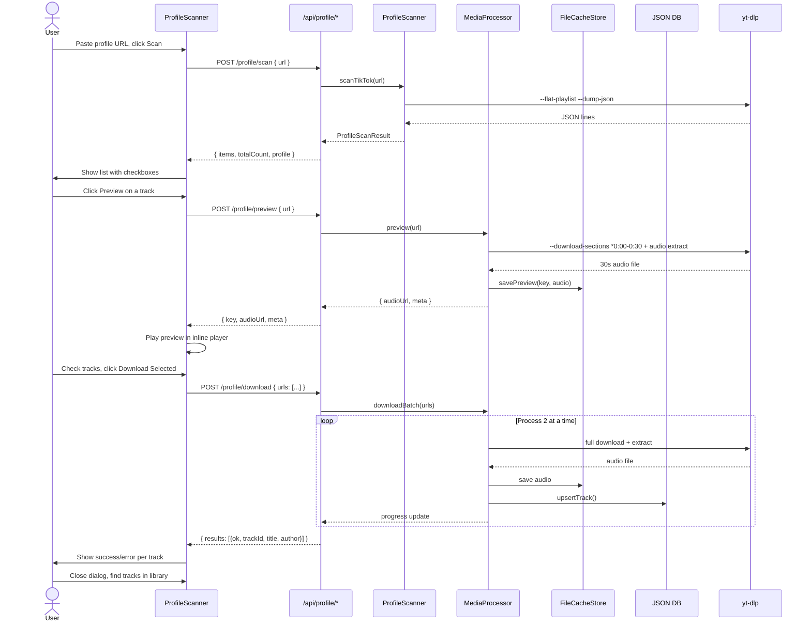

# Profile Download Feature — TikTok Bulk Import with Preview

## 1. Overview

Allow users to paste a TikTok profile URL (e.g., `https://www.tiktok.com/@username`), browse all videos from that profile, preview a 30-second snippet of any track, select which ones they want, and batch-import them into the library.

**Phase 1 scope:** TikTok profiles only. YouTube channels / SoundCloud artists deferred.

### User Flow

```
Enter profile URL → Scan → See list with metadata + preview buttons
  → Check tracks to download → Click "Download Selected"
  → Progress bar shows batch processing → Tracks appear in library
```

## 2. Architecture

### 2.1 URL Detection — Profile vs Single Video

Add a helper to [`lib/media/source.ts`](lib/media/source.ts) to distinguish profile URLs from single-content URLs:

```typescript
// A TikTok profile URL has pathname matching /@username with no /video/, /photo/ segment
export function isTikTokProfileUrl(url: string): boolean {
  // e.g. https://www.tiktok.com/@username
  // NOT  https://www.tiktok.com/@username/video/1234567890
  const pathname = url.pathname.replace(/\/+$/, '');
  return /^\/@[\w.]+(\/)?$/.test(pathname);
}
```

### 2.2 Profile Scanning — [`lib/media/profile.ts`](lib/media/profile.ts) (new)

Core scanning logic, separate from the single-track [`MediaProcessor`](lib/media/processor.ts).

```
class ProfileScanner {
  async scanTikTok(url: string): Promise<ProfileScanResult>
  async cleanup(): Promise<void>
}
```

**Scan process:**
1. Validates URL is a TikTok profile via `isTikTokProfileUrl()`
2. Runs `yt-dlp --flat-playlist --dump-json --ignore-errors <profile_url>`
   - `--flat-playlist`: Returns entries without resolving full metadata (fast)
   - `--dump-json`: One JSON line per video
   - `--ignore-errors`: Skip deleted/private videos gracefully
3. Parses each output line, extracts:
   - `id` (TikTok video ID)
   - `url` (full video URL)
   - `title`
   - `uploader` (author)
   - `duration` (seconds)
   - `thumbnail`
   - `view_count` (useful for sorting/filtering)
4. Returns typed result

**Return type:**
```typescript
interface ProfileScanResult {
  profile: {
    username: string;
    avatar?: string;
    followerCount?: number;
  };
  items: ProfileTrackItem[];
  totalCount: number;
}

interface ProfileTrackItem {
  id: string;          // TikTok video ID
  url: string;         // Normalized video URL
  title: string;
  author: string;
  duration: number;    // seconds
  thumbnail: string;
  viewCount?: number;
}
```

**Caching:** Scan results are cached in memory for 5 minutes to avoid repeated yt-dlp calls for the same profile URL. Use a `Map<string, { result: ProfileScanResult, expiresAt: number }>`.

### 2.3 Preview — 30-Second Section Download

Add a `preview()` method to [`MediaProcessor`](lib/media/processor.ts):

```typescript
class MediaProcessor {
  /**
   * Download only the first 30 seconds of audio for preview purposes.
   * Uses yt-dlp's --download-sections to minimize data transfer.
   * Stores in a separate "preview" temp cache (not the main library cache).
   * Returns a temporary audio URL that expires after 10 minutes.
   */
  async preview(url: string): Promise<PreviewResult>;
}
```

**Preview process:**
1. Resolve cache key from URL (same key derivation as `process()`)
2. Use a `preview:` prefix for the cache key to separate from full downloads
3. Run yt-dlp with:
   ```
   --download-sections "*0:00-0:30"
   --force-keyframes-at-cuts
   --extract-audio --audio-format m4a --audio-quality 0
   --output <preview_cache_dir>/<key>.m4a
   ```
4. Store preview metadata (title, author, cover, duration) in preview cache
5. Return `{ audioUrl: '/api/preview-audio/<key>', meta: TrackMeta }`
6. Schedule cleanup of preview files older than 10 minutes

**Cleanup:** On server startup, purge any preview files older than 10 minutes. Use a `setInterval` in the API route module for periodic cleanup.

### 2.4 Batch Download — Processing Multiple Tracks

Add a `downloadBatch()` method to [`MediaProcessor`](lib/media/processor.ts):

```typescript
class MediaProcessor {
  /**
   * Process multiple URLs in sequence, respecting MAX_CONCURRENT = 2.
   * Each URL goes through the full process() pipeline.
   * Reports progress via a callback.
   */
  async downloadBatch(
    urls: string[],
    onProgress: (completed: number, total: number, result: BatchItemResult) => void,
  ): Promise<BatchResult>;
}
```

**Batch process:**
1. Iterate through URLs, processing 2 at a time (respecting `MAX_CONCURRENT`)
2. Each track goes through the full `process()` pipeline (download full audio, extract, cache, persist to DB)
3. Report progress after each track completes
4. Collect results — track which succeeded and which failed
5. Return aggregate result

### 2.5 New API Endpoints

#### `POST /api/profile/scan`

```
Body:    { url: string }
Process: Validates → runs ProfileScanner.scanTikTok() → returns items
Output:  { ok: true, profile: {...}, items: [...], totalCount: number }
Rate:    5 req / 10 min per IP (heavy operation)
Cache:   In-memory dedup for identical profile URL within 5 min
Errors:  - 400 "URL TikTok profile không hợp lệ"
         - 400 "Không tìm thấy video nào trong profile này"
         - 500 "Lỗi khi quét profile"
```

#### `POST /api/profile/preview`

```
Body:    { url: string }
Process: Validates → runs MediaProcessor.preview() → returns temp audio URL
Output:  { ok: true, key: string, audioUrl: string, meta: { title, author, cover, duration } }
Rate:    20 req / 10 min per IP
Cleanup: Preview audio cached for 10 min, then auto-deleted
Errors:  - 400 "URL không hợp lệ"
         - 400 "Chỉ hỗ trợ URL TikTok"
         - 500 "Không thể tạo bản xem trước"
```

#### `POST /api/profile/download`

```
Body:    { urls: string[] }
Process: Validates → runs downloadBatch() → returns combined results
Output:  { ok: true, results: [{ url, ok, trackId?, title?, author?, error? }] }
Rate:    3 req / 10 min per IP (batch operation)
Limit:   max 50 URLs per batch (enforced, return 400 if exceeded)
Errors:  - 400 "Danh sách URL không hợp lệ"
         - 400 "Tối đa 50 URL mỗi lần"
         - 500 "Lỗi xử lý hàng loạt"
```

#### `GET /api/preview-audio/[key]`

Serve preview audio files from the temp preview cache. Same pattern as [`/api/audio/[key]`](app/api/audio/[key]/route.ts) but from preview cache directory. Include `Cache-Control: max-age=600` and `Content-Disposition` as attachment with preview indicator.

### 2.6 Cache Structure

| Cache | Location | Key pattern | TTL | Purpose |
|-------|----------|-------------|-----|---------|
| Main library | `CACHE_DIR/<key>.m4a` | `sha256hex` | Permanent | Full tracks in library |
| Preview temp | `CACHE_DIR/preview/<key>.m4a` | `preview:<sha256hex>` | 10 min | 30-second snippets |
| Scan results | In-memory `Map` | Profile URL | 5 min | Profile listing |

### 2.7 Rate Limiting Strategy

The existing [`checkRateLimit()`](lib/rateLimit.ts) uses per-IP counters. For batch operations, we need slightly higher limits:

| Endpoint | Limit | Window |
|----------|-------|--------|
| `/api/profile/scan` | 5 | 10 min |
| `/api/profile/preview` | 20 | 10 min |
| `/api/profile/download` | 3 | 10 min (but processes up to 50 tracks) |
| `/api/process` | 10 (unchanged) | 10 min |

The `/api/profile/download` endpoint bypasses the per-track rate limit since it's a single request handling multiple tracks internally. This prevents the user from hitting the 10/10min limit trying to import 50 tracks individually.

### 2.8 Data Flow Diagram

```
┌─────────────────────────────────────────────────────────────────┐
│                        FRONTEND                                 │
│                                                                 │
│  ┌────────────────┐    ┌──────────────────┐    ┌──────────────┐ │
│  │ ProfileScanner  │    │ Preview playback  │    │ BatchImport  │ │
│  │ Component       │───▶│ via PlayerPanel   │───▶│ Progress     │ │
│  └───────┬────────┘    └──────────────────┘    └──────┬───────┘ │
│          │                                            │          │
└──────────┼────────────────────────────────────────────┼──────────┘
           │ POST /profile/scan   POST /profile/download│
           ▼                                            ▼
┌────────────────────┐    ┌──────────────────────────────────────┐
│  /api/profile/scan  │    │  /api/profile/download              │
│  ┌───────────────┐  │    │  ┌────────────────────────────────┐ │
│  │ProfileScanner  │  │    │  │MediaProcessor.downloadBatch() │ │
│  │.scanTikTok()   │  │    │  │  → process() per track        │ │
│  └───────┬───────┘  │    │  │  → upsertTrack() to DB         │ │
│          │           │    │  └──────────┬─────────────────────┘ │
└──────────┼───────────┘    └─────────────┼───────────────────────┘
           │                              │
           ▼                              ▼
┌──────────────────────┐     ┌────────────────────────┐
│ yt-dlp --flat-playlist│     │  yt-dlp + ffmpeg       │
│ --dump-json           │     │  (via MediaProcessor)  │
└──────────────────────┘     └───────────┬────────────┘
                                         │
                                         ▼
                                ┌────────────────────┐
                                │  FileCacheStore     │
                                │  + JSON DB (tikplay)│
                                └────────────────────┘

Preview flow (separate):
┌─────────────┐   POST /profile/preview   ┌──────────────────┐
│  User clicks │ ─────────────────────────▶│ MediaProcessor   │
│  Preview btn │                           │ .preview()       │
└──────┬──────┘                           │ → yt-dlp sections│
       │                                   │ → temp cache     │
       │        GET /preview-audio/[key]    └────────┬─────────┘
       │◀─────────────────────────────────────────────┘
       ▼
┌─────────────┐
│ PlayerPanel  │ (existing component plays the preview)
└─────────────┘
```

## 3. Frontend Architecture

### 3.1 New Components

#### [`components/ProfileScanner.tsx`](components/ProfileScanner.tsx) — Main scanner UI

```
+---------------------------------------------------+
| [X] Import từ TikTok Profile                       |
+---------------------------------------------------+
| Dán link TikTok Profile: [____________________]   |
| [Quét profile]                                     |
+---------------------------------------------------+
| 12 video tìm thấy từ @tiktokuser                   |
|                                                    |
| ☐ Tất cả (12)                   [Tải đã chọn (0)]  |
|                                                    |
| ☐ ██ Title 1                    Author  ★ 0:45 ▶  |
| ☐ ██ Title 2                    Author  ★ 1:20 ▶  |
| ☐ ██ Title 3                    Author  ★ 0:30 ▶  |
| ...                                                |
+---------------------------------------------------+
```

**State:**
```typescript
interface ProfileScannerState {
  status: 'idle' | 'scanning' | 'scanned' | 'downloading';
  profileUrl: string;
  scanResult: ProfileScanResult | null;
  selectedUrls: Set<string>;      // checked items
  previewingUrl: string | null;   // currently previewing
  downloadProgress: {
    total: number;
    completed: number;
    failed: number;
    results: BatchItemResult[];
  } | null;
  error: string | null;
}
```

**Key behaviors:**
- Profile URL input with validation (must match TikTok profile pattern)
- "Scan" button triggers POST `/api/profile/scan`
- Results displayed in a virtualized scrollable list (reuse virtualization pattern from [`TrackList`](components/TrackList.tsx:23))
- Each row has:
  - Checkbox
  - Thumbnail (use [`Cover`](components/Cover.tsx) component)
  - Title + author
  - Duration formatted as mm:ss
  - Preview button (▶) — triggers preview, shows spinner while loading
  - When preview is playing, show ■ (stop) icon
- "Select All" / "Deselect All" toggle
- "Download Selected (N)" button — only active when selection > 0
- During download: progress bar (X/Y completed), per-track status (spinner/checkmark/error)
- Close/minimize button

#### [`components/ProfileTrackRow.tsx`](components/ProfileTrackRow.tsx) — Individual track row

Props:
```typescript
interface ProfileTrackRowProps {
  item: ProfileTrackItem;
  isSelected: boolean;
  isPreviewing: boolean;
  onToggleSelect: (url: string) => void;
  onPreview: (url: string) => void;
}
```

Reuses styling patterns from [`TrackRow`](components/TrackRow.tsx) but:
- Replaces the play-icon with a checkbox
- Adds preview button separate from selection
- No favorite/remove/actions buttons
- Different layout to accommodate "preview" badge

### 3.2 Preview Playback Strategy

When user clicks preview:
1. Frontend calls `POST /api/profile/preview` with `{ url }`
2. Backend returns `{ ok: true, key, audioUrl: '/api/preview-audio/<key>', meta }`
3. Frontend creates a **temporary preview audio element** (NOT the global player — preview must not disrupt what's currently playing in the main PlayerPanel)
4. A small inline player appears in the track row, or a floating mini-player at the bottom

**Preview audio management:**
- Use a dedicated `HTMLAudioElement` managed within [`ProfileScanner`](components/ProfileScanner.tsx) state
- Only one preview plays at a time — clicking preview on another track stops the current preview
- Main PlayerPanel playback is unaffected
- Preview stops when the dialog closes

**Preview mini-player** (inside ProfileScanner):
```
┌──────────────────────────────────────────────┐
│ ▶ Title preview (0:30)        [00:15] ═══●══ │
└──────────────────────────────────────────────┘
```

With play/pause, seek, and close button.

### 3.3 Integration Points

#### Entry Point: Add button to `UrlInput` area or Sidebar

Add a "Tải từ Profile" button/link that toggles the ProfileScanner dialog.

In [`components/AppShell.tsx`](components/AppShell.tsx):
- Render `<ProfileScanner>` as a modal/dialog when activated
- Or mount it as a panel overlay (like the current player panel)

**Option A — Dialog overlay** (recommended):
- A full-screen or large dialog that covers the content area
- "Đóng" (Close) button to dismiss
- Non-blocking — can still hear main player in background

**Option B — Tab in the main content area**:
- A new view state `view === 'profile-scan'` alongside 'home' and 'library'
- Accessed from sidebar or a button

**Recommendation:** Option A (dialog) for phase 1 — simpler, self-contained, doesn't require routing changes.

#### Entry Button Location

Add a secondary button in the [`UrlInput`](components/UrlInput.tsx) area or the sidebar:

```tsx
// In AppShell.tsx sidebar area, or next to UrlInput
<button onClick={() => setShowProfileScanner(true)}>
  <UserPlusIcon size={16} />
  Tải từ Profile
</button>
```

## 4. Database & Cache Changes

### 4.1 No Schema Changes

The existing [`DbTrack`](lib/types.ts:14) schema supports all fields needed. Batch-imported tracks use the same `upsertTrack()` flow. Source is `'tiktok'` same as single imports.

### 4.2 Preview Cache

New temporary cache directory: `CACHE_DIR/preview/`

Uses existing [`FileCacheStore`](lib/cache/index.ts) with a namespace prefix, or a simple file-based approach with `ensureCacheDir(CACHE_DIR + '/preview')`.

```typescript
// lib/cache/index.ts additions
class FileCacheStore {
  async savePreview(key: string, buffer: Buffer): Promise<void>;
  async getPreview(key: string): Promise<Buffer | null>;
  async deletePreview(key: string): Promise<void>;
  async cleanExpiredPreviews(maxAgeMs: number): Promise<number>;
}
```

Preview files named `<key>.m4a` in the preview subdirectory. A periodic cleanup job (run on API call or via `setInterval`) removes files older than 10 minutes.

## 5. Implementation Phases

### Phase 1A — Backend Core

| # | Task | File(s) | Description |
|---|------|---------|-------------|
| 1 | Add `isTikTokProfileUrl()` helper | [`lib/media/source.ts`](lib/media/source.ts) | Detect TikTok profile URLs vs single video URLs |
| 2 | Create `ProfileScanner` class | [`lib/media/profile.ts`](lib/media/profile.ts) (new) | Scan TikTok profile via `yt-dlp --flat-playlist` |
| 3 | Add `preview()` method to `MediaProcessor` | [`lib/media/processor.ts`](lib/media/processor.ts) | Download 30s section with `--download-sections` |
| 4 | Add `downloadBatch()` method to `MediaProcessor` | [`lib/media/processor.ts`](lib/media/processor.ts) | Batch process multiple URLs respecting concurrency |
| 5 | Add preview cache methods to `FileCacheStore` | [`lib/cache/index.ts`](lib/cache/index.ts) | `savePreview`, `getPreview`, `cleanExpiredPreviews` |
| 6 | Create `/api/profile/scan` route | [`app/api/profile/scan/route.ts`](app/api/profile/scan/route.ts) (new) | POST handler for profile scanning |
| 7 | Create `/api/profile/preview` route | [`app/api/profile/preview/route.ts`](app/api/profile/preview/route.ts) (new) | POST handler for 30s preview |
| 8 | Create `/api/profile/download` route | [`app/api/profile/download/route.ts`](app/api/profile/download/route.ts) (new) | POST handler for batch download |
| 9 | Create `/api/preview-audio/[key]` route | [`app/api/preview-audio/[key]/route.ts`](app/api/preview-audio/[key]/route.ts) (new) | GET handler to serve preview audio |

### Phase 1B — Frontend

| # | Task | File(s) | Description |
|---|------|---------|-------------|
| 10 | Create `ProfileTrackRow` component | [`components/ProfileTrackRow.tsx`](components/ProfileTrackRow.tsx) (new) | Row with checkbox, thumbnail, preview button |
| 11 | Create `ProfileScanner` component | [`components/ProfileScanner.tsx`](components/ProfileScanner.tsx) (new) | Main scanner dialog with scan/download flow |
| 12 | Wire preview audio into scanner | [`components/ProfileScanner.tsx`](components/ProfileScanner.tsx) | Handle preview playback within dialog |
| 13 | Add entry button + mount scanner | [`components/AppShell.tsx`](components/AppShell.tsx) or [`components/Sidebar.tsx`](components/Sidebar.tsx) | Trigger button to open scanner dialog |

### Phase 1C — Polish & Testing

| # | Task | File(s) | Description |
|---|------|---------|-------------|
| 14 | Add E2E test for profile scan flow | [`e2e/profile-download.spec.ts`](e2e/profile-download.spec.ts) (new) | Test scan + preview + batch download |
| 15 | Run lint and typecheck | — | `npm run lint`, `npx tsc --noEmit` |
| 16 | Cleanup and error handling | Various | Handle edge cases: empty profile, private profile, network errors |

## 6. Key Design Decisions

### Why client-side batch download loop instead of server-side SSE?

The factory `MAX_CONCURRENT = 2` already limits server load. A single HTTP request that processes 50 tracks sequentially on the server is simpler than SSE streaming and avoids frontend complexity. The user sees a progress bar updated by polling the batch status, or the endpoint blocks until all results are ready (~30-60s for 50 tracks at 2 concurrent). For phase 1, blocking request is acceptable since:
- The server has a 60s timeout (Next.js default for Node.js runtime)
- 50 tracks × ~15s avg processing / 2 concurrency ≈ 375s — **this is over 6 minutes**

**Revised approach:** 
- Process 2 at a time server-side
- Return results in batches via a simple poll mechanism
- OR: Process the first batch of 2, return partial results with a job ID, frontend polls for more

**Actually, the simplest viable approach:**
- The `/api/profile/download` endpoint processes **max 10 tracks per batch** (not 50)
- Each batch takes ~15-60s
- If the user has more, they click "Continue" for the next batch
- This keeps request duration reasonable

**Alternative (recommended for phase 1):**
- Frontend orchestrates: iterate through selected URLs client-side, calling `/api/process` for each (same as existing `addTrackFromUrl`)
- But bypass rate limiting with a special header or token
- Show progress based on `(completed / total)`
- This reuses existing infrastructure completely

Let's go with the **frontend-orchestrated** approach:
- Frontend loops through selected URLs
- Calls `/api/process` for each (existing endpoint, battle-tested)
- Need to adjust rate limit for batch operations or add an internal batch endpoint
- Add a `batch` mode: `POST /api/process` with `{ url, batch: true }` that uses a different rate limit key

Actually, looking at the rate limit more carefully: `checkRateLimit` uses IP-based key `process:${requestIp(req)}`. If we process 50 tracks, we hit the 10/10min limit.

**Final decision:** Create a dedicated `/api/profile/download` endpoint that:
- Accepts up to 20 URLs per call
- Uses its own rate limit (3 calls / 10 min = up to 60 tracks)
- Internally calls `MediaProcessor.process()` for each (respecting `MAX_CONCURRENT`)
- Returns results as JSON array
- If processing takes too long, returns partial results with a `continued` flag + cursor for next batch

This is the cleanest approach for the user experience.

### Why not reuse `/api/process` for batch?

1. Rate limit collision — batch operations would exhaust the 10/10min limit
2. No atomicity — partial failures need coordinated reporting
3. User experience — a single progress bar from one endpoint is simpler than N individual requests

### Preview vs Full Download Cache Strategy

Preview uses a separate cache namespace (`preview:<key>`) so:
- Preview download (30s) doesn't pollute the main cache
- When user later downloads the full track, it's a fresh download with the full duration
- Preview files auto-expire after 10 minutes via periodic cleanup

## 7. Risks & Mitigations

| Risk | Impact | Mitigation |
|------|--------|------------|
| TikTok profile with 1000+ videos | Long scan time, large response | Cap scan at 200 items. Show "Showing first 200 of N videos" message. Add search/filter within scanned results. |
| yt-dlp `--download-sections` doesn't work with TikTok extractor | Preview not possible | Fallback: download full audio but trim to 30s via ffmpeg post-processing (more data but same result). |
| Rate limit too restrictive for batch | User frustrated | Monitor batch usage, adjust limits based on feedback. 3 batches × 20 tracks = 60 tracks/10min is reasonable for a personal music tool. |
| Preview audio disrupts current playback | Bad UX | Preview uses **separate** `HTMLAudioElement`, not the global PlayerPanel engine. Stop preview when user interacts with main player. |
| TikTok profile is private or empty | Confusing error | Clear error messages: "Profile không công khai hoặc không có video nào." Link to public content guidelines. |
| yt-dlp TikTok extractor throttles or blocks | Scan fails | Already have retry logic in `execYtDlp()`. For profile scanning, add 3 retries with linear backoff matching the existing pattern. |

## 8. Sequence Diagram — Full User Flow



## 9. Files Changed Summary

### New Files
| File | Purpose |
|------|---------|
| `lib/media/profile.ts` | Profile scanner logic (yt-dlp flat-playlist) |
| `components/ProfileScanner.tsx` | Main scanner dialog UI |
| `components/ProfileTrackRow.tsx` | Track row in scanner list |
| `app/api/profile/scan/route.ts` | POST handler for profile scanning |
| `app/api/profile/preview/route.ts` | POST handler for 30s preview |
| `app/api/profile/download/route.ts` | POST handler for batch download |
| `app/api/preview-audio/[key]/route.ts` | GET handler for preview audio serving |
| `e2e/profile-download.spec.ts` | E2E test for profile flow |

### Modified Files
| File | Changes |
|------|---------|
| `lib/media/source.ts` | Add `isTikTokProfileUrl()` |
| `lib/media/processor.ts` | Add `preview()` and `downloadBatch()` methods |
| `lib/cache/index.ts` | Add preview cache methods (`savePreview`, `getPreview`, `cleanExpiredPreviews`) |
| `components/AppShell.tsx` or `components/Sidebar.tsx` | Add button to open profile scanner |

### No Changes Needed
| File | Reason |
|------|--------|
| `lib/types.ts` | Existing `Track`/`DbTrack` types sufficient |
| `lib/db/queries.ts` | Existing `upsertTrack()` handles batch imports |
| `hooks/useAppStore.tsx` | Preview is self-contained in scanner; downloaded tracks trigger existing refresh flows |
| `hooks/usePlayback.tsx` | Preview uses separate audio element |
| `docs/player-architecture.md` | No playback architecture changes |
